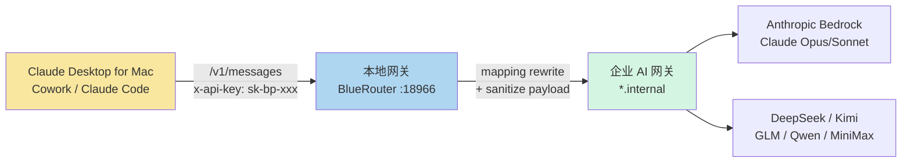
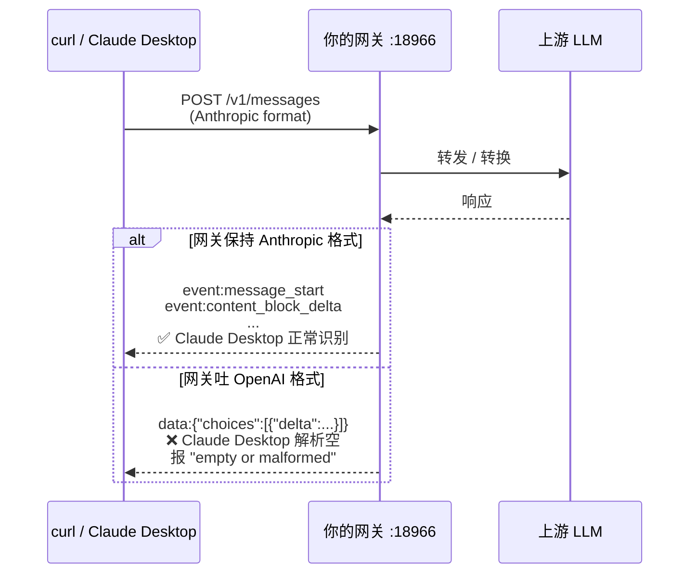
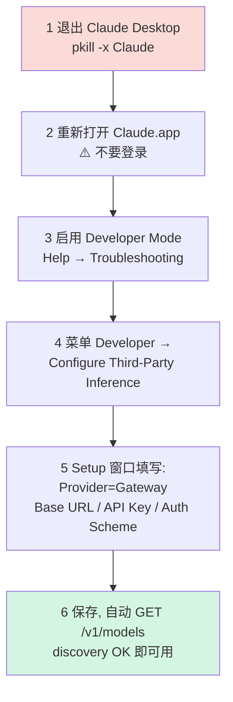
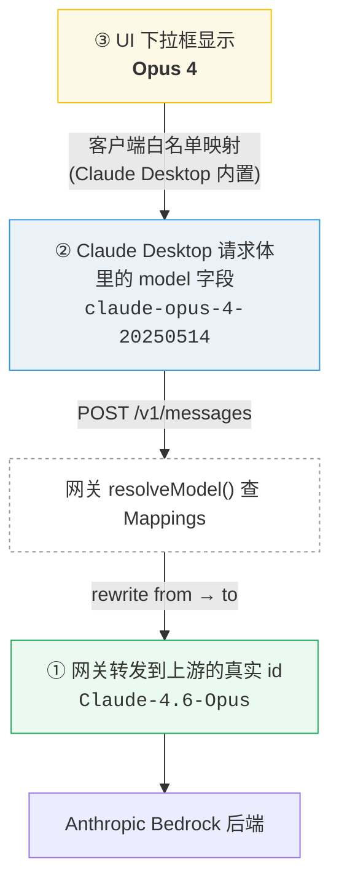
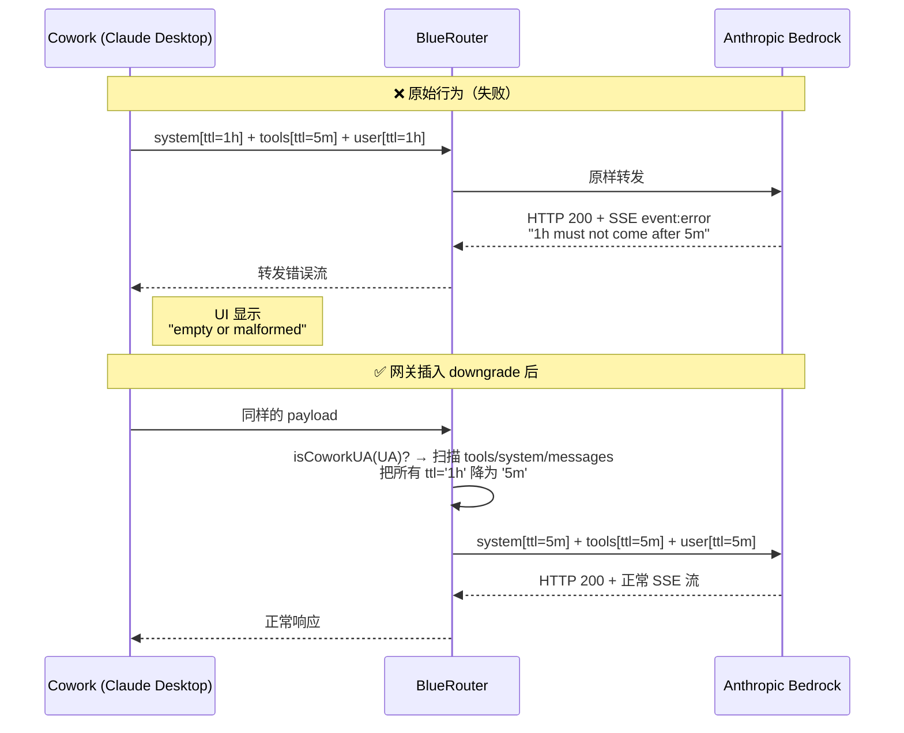

## TL;DR

Claude Desktop for Mac（v1.4758.0 起）**支持接入任意 Anthropic Messages 兼容的网关**，通过 Developer Mode 下的 "Configure Third-Party Inference" 窗口配置即可。全程不需要 Anthropic 官方账号。本文以接入本地自建网关 BlueRouter（`http://127.0.0.1:18966`）为例，记录完整配置步骤、底层机制、以及实际踩过的坑。

### 整体拓扑



---

## 一、前置验证：先确认你的网关协议兼容

Claude Desktop 的第三方模式走 **Anthropic `/v1/messages` 协议**（不是 OpenAI `/v1/chat/completions`）。配置之前用 curl 验证一下：

```bash
curl -X POST http://127.0.0.1:18966/v1/messages \
  -H "content-type: application/json" \
  -H "anthropic-version: 2023-06-01" \
  -H "x-api-key: YOUR_KEY" \
  -d '{
    "model": "claude-sonnet-4-5-20250929",
    "max_tokens": 30,
    "messages": [{"role":"user","content":"say OK"}]
  }'
```

**期望返回**：HTTP 200 + 形如 `{"id":"msg_...", "content":[{"type":"text","text":"OK"}], ...}` 的 Anthropic 格式 JSON。

两种协议格式的差异直接决定能不能用：



如果返回的是 OpenAI 格式（`{"choices":[{"delta":...}]}`），说明网关只做 OpenAI 协议透传，Claude Desktop 会报：

```
API Error: API returned an empty or malformed response (HTTP 200)
— check for a proxy or gateway intercepting the request
```

这种情况下需要在网关前加一层 `OpenAI → Anthropic` 协议转换层（如 [LiteLLM](https://github.com/BerriAI/litellm)）。

---

## 二、Claude Desktop 支持的配置字段

从 Claude Desktop 的 `app.asar` 反出来，第三方模式的真实 schema 如下：

| 字段 | 类型 | 说明 |
|---|---|---|
| `inferenceProvider` | `gateway` \| `vertex` \| `bedrock` \| `foundry` | 选 `gateway` 表示走通用 Anthropic 兼容网关 |
| `inferenceGatewayBaseUrl` | string | 网关基础 URL，如 `http://127.0.0.1:18966` |
| `inferenceGatewayApiKey` | string (加密存储) | 通过 macOS Keychain + Electron `safeStorage` 加密，**无法离线写文件** |
| `inferenceGatewayAuthScheme` | `x-api-key` \| `bearer` \| ... | 认证 header 方案 |
| `inferenceGatewayHeaders` | object | 自定义 HTTP headers |
| `inferenceModels` | array | 可选白名单，设了就用它覆盖 `/v1/models` 自动发现 |

**关键点**：因为 API key 是 `safeStorage` 加密存储的（Electron 通过系统 Keychain 加密），**必须从 GUI 一次性输入**，不能直接改配置文件。

实际网关管理页（BlueRouter Models 标签）看起来是这样 —— 可以清晰看到**每个模型的 ID / 别名 / Provider 归属**，本文后面的"三套命名体系"章节就是从这张表延伸出来的：


---

## 三、完整配置步骤

六步流程概览：



### 1. 退出 Claude Desktop

```bash
pkill -x Claude
```

或 `⌘Q`。必须彻底退出，否则已登录的账号态会抢占 provider slot。

### 2. 重新打开 Claude.app — 不要登录

登录界面直接关掉或忽略。

### 3. 启用 Developer Mode

菜单栏 → **Help → Troubleshooting → Enable Developer Mode**

如果菜单里没有这项，说明已经启用过（检查 `~/Library/Application Support/Claude/developer_settings.json`，里面应有 `"allowDevTools": true`）。

### 4. 打开第三方推理配置

菜单栏会多出 **Developer** 菜单 → **Configure Third-Party Inference**

### 5. 在 Setup 窗口里填写

| 字段 | 填什么 |
|---|---|
| **Provider** | `Gateway` |
| **Base URL** | `http://127.0.0.1:18966`（或你的网关地址） |
| **Auth Scheme** | `x-api-key`（多数开源网关用这个） |
| **API Key** | 你的 API key |
| **Extra Headers** | 留空 |

保存时，Claude Desktop 会自动 `GET /v1/models` 做一次 discovery，Setup 页面会提示 "Gateway discovery OK, N models loaded"。

### 6. 重启 / 进入主界面即可使用

左下角会显示 **"Cowork 3P \| Gateway"**，说明当前处于第三方模式。**Claude Code 标签**此时就完全可用了：


---

## 四、三套命名体系：别被混淆

Claude Desktop 展示出来的模型名和网关实际的 id 可能完全不同，这是因为**中间隔了三层映射**：

| 层 | 哪里看到 | 例子 |
|---|---|---|
| ① 上游真实内部 ID | 网关管理页 | `Claude-4.6-Opus` |
| ② 网关对外暴露 ID | `/v1/models` 返回的 `id` | `claude-opus-4-20250514` |
| ③ Claude Desktop 美化名 | 下拉框 UI | `Opus 4` |

**为什么要三层？**
- ② 层通常故意做成 **Anthropic 官方规范 id**（带日期后缀），这样任何 Anthropic SDK / 客户端都能原生识别。
- ③ 层是 Claude Desktop 内置的白名单映射：它识别 `claude-opus-4-*` / `claude-sonnet-4-*` 后显示为 `Opus 4` / `Sonnet 4`，不在白名单的（deepseek / glm / qwen 等）原样显示 id。

配置完后 Claude Desktop 下拉框显示 `Opus 4.6` 其实对应网关 `claude-opus-4-20250514`，**客户端请求 body 里传的是第 ② 层 id**，网关再映射到第 ① 层路由到上游。

以 Claude Opus 为例走一遍完整链路：



`deepseek-chat`、`glm-4-plus` 等非 Claude 模型同理：UI 层没美化（不在 Claude Desktop 白名单里），所以 ③ 和 ② 长得一样；到了 ① 才映射成上游真实 id（如 `Baidu-DeepSeek-V3.2`）。

**请求方向**：客户端拿 UI 显示名选了 `Opus 4`，实际请求 body 里传的是 ② 的 `claude-opus-4-20250514`，网关内 `resolveModel()` 查 Mappings 改写成 ① 的 `Claude-4.6-Opus`，转发给上游。

---

## 五、常见坑

### 坑 1：Cowork Chat 页面报 "empty or malformed response"

症状：`/v1/messages` 返回 HTTP 200 但 Claude Desktop 说响应为空。UI 上长这样：


**真因**（我自己踩过的最坑）：不是协议问题，而是 Cowork 发的请求里 `cache_control.ttl` 顺序违反 Anthropic 规则：

```
messages.2.content.2.cache_control.ttl: a ttl='1h' cache_control block
must not come after a ttl='5m' cache_control block.
Note that blocks are processed in the following order: tools, system, messages.
```

Anthropic API 要求：所有 `ttl='1h'` 的 cache_control block 必须出现在 `ttl='5m'` 块**之前**（按 tools → system → messages 扫描顺序）。Cowork 的 SDK 在 system 和最后一个 user message 都打了 `ttl='1h'` 标记，而内部 SDK 在中间插入了 `ttl='5m'` 的块，导致顺序违反。

顺序问题与修复示意：



**解决**：在网关侧做请求改写，把 Cowork 请求里的 `ttl='1h'` 全部降级为 `ttl='5m'`。Claude Code CLI 的 UA 是 `claude-code`，不受此问题影响，**保留其 1h 缓存可以显著降低长会话的 token 成本**。

UA 识别方案（以 BlueRouter 为例）：

```go
func isCoworkUA(ua string) bool {
    return strings.Contains(ua, "claude-desktop-3p") ||
           strings.Contains(ua, "local-agent")
}
```

两个 UA 标记都是 Cowork 的（旧版用 `claude-desktop-3p`，新版用 `local-agent`）。

### 坑 2：每次启动默认都是第一个模型（而且是非 Claude 的）

Claude Desktop 第三方模式**不跨 session 持久化模型选择**。新 session 默认是 `/v1/models` 返回数组的第一个元素，按字母序排。

**解决方案 A**：在 Setup 窗口的 `inferenceModels` 字段填白名单，只放你想用的 Claude 模型。

**解决方案 B**：在网关侧改 `/v1/models` 响应顺序，把 Claude 模型排前面。BlueRouter 实现：

```go
sort.SliceStable(list, func(i, j int) bool {
    ci, cj := isClaude(list[i].ID, list[i].Name),
              isClaude(list[j].ID, list[j].Name)
    if ci != cj {
        return ci
    }
    return list[i].ID < list[j].ID
})
```

### 坑 3：选了非 Claude 模型就报错

如果网关对非 Claude 模型只做 OpenAI 协议 passthrough，Claude Desktop 解析 OpenAI 流会解出空 → 报 "empty or malformed response"。

**解决**：要么在下拉框里只选 Claude 系模型（`Opus / Sonnet / Haiku`），要么在网关前加 LiteLLM 做 OpenAI → Anthropic 转换。

### 坑 4：Chat 页面不可用或灰掉

第三方 provider 模式下官方客户端的 Chat 面板**可能会被禁用或隐藏**，这是官方产品限制。可用的是 **Cowork / Code** 等 agentic 功能。

---

## 六、切换回官方模式

**Developer → Configure Third-Party Inference → Reset** 即可，不会丢账号。

---

## 七、企业批量部署

如果是组织级部署，可以用 macOS `.mobileconfig` 文件 + MDM 推送，无需每台机器手动配置。支持的 provider 包括：

- `gateway` — 通用 Anthropic 兼容网关
- `bedrock` — AWS Bedrock
- `vertex` — Google Vertex AI
- `foundry` — Azure AI Foundry

---

## 参考

- Claude Desktop 配置目录：`~/Library/Application Support/Claude/`
- 已启用的 Developer flag：`~/Library/Application Support/Claude/developer_settings.json`
- 官方 Cowork 第三方文档：[support.claude.com](https://support.claude.com)
- BlueRouter 源码（本文调试用）：[iqiancheng/bluecode-proxy](https://github.com/iqiancheng/bluecode-proxy)

---

**本文基于 Claude Desktop v1.4758.0 实测整理。**
