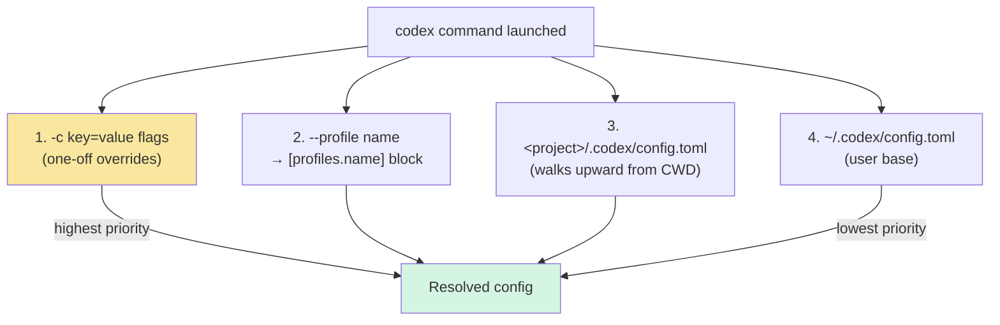

## TL;DR

**OpenAI Codex CLI + Codex 桌面 App 都支持任意 OpenAI Responses API 兼容的网关**，通过 `~/.codex/config.toml` 的 `[model_providers.<id>]` 自定义即可。最简场景只改一行 `openai_base_url` 就能把 built-in openai provider 指向代理；复杂场景可以自定义多个 provider、env header、命令式动态 token、profile 多账号切换。

> 配 **Claude Code CLI** 看 [这篇](/posts/2026-05-07-claude-code-cli-third-party-gateway.html)；**Claude Desktop App** 看 [这篇](/posts/2026-05-07-claude-desktop-third-party-inference.html)。本文覆盖 Codex CLI 和 Codex App。

### App 与 CLI 共享配置（反编译验证）

和 Claude Desktop 有独立 "Configure Third-Party Inference" 窗口不同，**Codex 桌面 App 没有自己的 provider 配置 GUI** —— 它直接读 CLI 的 `~/.codex/config.toml`。

反编译 `Codex.app/Contents/Resources/app.asar` 能看到路径解析和 CLI 完全一致：

```js
// 来自 app.asar：Codex 桌面 App 解析 config 目录的逻辑
function Am(e) {
  let t = e ?? (typeof process < "u" ? {} : void 0);
  return t?.CODEX_HOME && t.CODEX_HOME.length > 0
    ? normalize(t.CODEX_HOME)
    : t?.HOME && t.HOME.length > 0
      ? normalize(join(t.HOME, ".codex"))
      : "/.codex";
}
```

且 App 内部初始化 provider 用的是同一套 `model_providers.<id>.{name, base_url, experimental_bearer_token, wire_api}` schema。所以**本文所有配置对 App 和 CLI 都通用**，唯一差别是：

- **CLI 用户**：直接编辑 `~/.codex/config.toml`，或用 `-c key=value` 一次性覆盖
- **App 用户**：同样编辑 `~/.codex/config.toml`，然后重启 App。`-c` CLI flag 在 `codex app` 启动时也支持，会透传给 App

---

## 一、重要前置：你的网关必须支持 Responses API

这是 Codex 和 Claude Code 最大的差异点：

| CLI | 要求网关支持的协议 |
|---|---|
| Claude Code | Anthropic `/v1/messages` |
| **Codex** | **OpenAI `/v1/responses` (Responses API)** |

Codex 的 `wire_api` 配置项目前**官方只支持 `responses` 一个值**，不支持 Chat Completions (`/v1/chat/completions`)。很多自建网关（如 one-api、LiteLLM 某些版本、OpenRouter 旧版）**默认只开 Chat Completions**，需要你：
- 确认网关版本支持 Responses API，或
- 在网关前加转换层（较新版 LiteLLM 支持 `/v1/responses` 适配），或
- 升级网关

先用 curl 验证你的网关（`/v1/responses` 这个路径必须通）：

```bash
curl -sN -X POST https://gateway.example.com/v1/responses \
  -H "Authorization: Bearer <YOUR_API_KEY>" \
  -H "content-type: application/json" \
  -d '{
    "model": "gpt-5.4",
    "input": "say OK"
  }' | head -20
```

返回含 `"type":"response.output_text.delta"` / `"type":"response.completed"` 就说明网关 OK。如果返回 `"message":"This endpoint is not supported"` 之类，就是不支持。

---

## 二、配置文件层级



关键点：
- **项目级 `.codex/config.toml`** 只在 "trusted" 项目里生效（Codex 有信任列表机制，防止恶意 repo 提 PR 偷改配置）
- **`-c key=value`** 的 value 会按 TOML 解析（字符串要自己加引号），不是 JSON
- **`CODEX_HOME`** 环境变量可以换掉 `~/.codex` 整个目录，适合 CI

---

## 三、方式 A：只改 built-in openai provider 的 Base URL（最简）

如果你的网关就是个 OpenAI Responses API 的转发层，用默认 provider，只改 URL：

```toml
# ~/.codex/config.toml
openai_base_url = "https://gateway.example.com/v1"
```

API key 仍走标准 env var `OPENAI_API_KEY`：

```bash
export OPENAI_API_KEY="<YOUR_API_KEY>"
codex "hello"
```

**适用**：单个代理、对所有 OpenAI 请求统一加 URL prefix、数据驻留项目。

**不适用**：同时用多个 provider、每个 provider 不同 key / header、需要动态 token。

> 官方文档原话：*"If you just need to point the built-in OpenAI provider at an LLM proxy, router, or data-residency enabled project, set `openai_base_url` in config.toml instead of defining a new provider."*

---

## 四、方式 B：自定义 `[model_providers.<id>]`（完整方案）

```toml
# ~/.codex/config.toml
model = "gpt-5.4"
model_provider = "proxy"

[model_providers.proxy]
name = "My LLM Proxy"
base_url = "https://gateway.example.com/v1"
env_key = "PROXY_API_KEY"          # 从环境变量读 key
wire_api = "responses"              # 目前只能是 responses
request_max_retries = 4
stream_idle_timeout_ms = 300000
```

Shell 里 `export PROXY_API_KEY=...`，`codex` 启动时就会带上 `Authorization: Bearer $PROXY_API_KEY`。

**为什么推荐用 `env_key` 而不是 `experimental_bearer_token`**：后者把 key 硬编码在 config 里，config 有机会被 backup / 同步 / 共享，泄露风险高。官方文档也明确标 `experimental_bearer_token` 为 *"discouraged; use env_key"*。

---

## 五、方式 C：自定义 HTTP Headers

有些企业网关需要额外的 `X-Organization-Id` / `X-Project-Id` / 自己的 `X-Api-Key` 等 header。有两种写法：

### 静态 header（固定值）

```toml
[model_providers.proxy]
base_url = "https://gateway.example.com/v1"
env_key = "PROXY_API_KEY"
http_headers = { "X-Organization-Id" = "org_xxx", "X-Project-Id" = "proj_yyy" }
```

### 环境变量驱动的 header（动态值）

```toml
[model_providers.proxy]
base_url = "https://gateway.example.com/v1"
env_key = "PROXY_API_KEY"
env_http_headers = { "X-User-Id" = "CODEX_USER_ID", "X-Session-Id" = "CODEX_SESSION_ID" }
```

运行时会查找对应 env var 的值填进 header。env var 不存在就不发这个 header（不是发空字符串，是整个 header 省略）。

---

## 六、方式 D：命令式动态 token（高阶）

适合 key 频繁轮转的场景（1Password / Vault / AWS Secrets Manager / 内部 SSO exchange）：

```toml
[model_providers.proxy]
name = "My LLM Proxy"
base_url = "https://gateway.example.com/v1"
wire_api = "responses"

[model_providers.proxy.auth]
command = "/usr/local/bin/fetch-codex-token"
args = ["--audience", "codex"]
timeout_ms = 5000
refresh_interval_ms = 300000       # 5 min 主动刷新；设 0 则只在 401 后刷新
```

`fetch-codex-token` 脚本只需要**把当前 token 打到 stdout**：

```bash
#!/usr/bin/env bash
# 示例：从 1Password 拉
op read "op://Private/codex-gateway/credential"

# 示例：从 AWS Secrets Manager 拉
# aws secretsmanager get-secret-value \
#   --secret-id codex-gateway-token \
#   --query SecretString --output text
```

**注意**：`auth.command` 不能和 `env_key` / `experimental_bearer_token` / `requires_openai_auth` 同时使用，互斥。

---

## 七、多账号：Profiles

给不同网关起不同名字，用 `--profile` 切换：

```toml
# ~/.codex/config.toml
model = "gpt-5.4"
model_provider = "openai"   # 默认走官方

[model_providers.proxy-work]
name = "Work Proxy"
base_url = "https://work-gw.example.com/v1"
env_key = "WORK_PROXY_KEY"

[model_providers.proxy-personal]
name = "Personal Proxy"
base_url = "https://personal-gw.example.com/v1"
env_key = "PERSONAL_PROXY_KEY"

[profiles.work]
model_provider = "proxy-work"
model = "gpt-5.4"
approval_policy = "on-request"

[profiles.personal]
model_provider = "proxy-personal"
model = "gpt-5-pro"
model_reasoning_effort = "high"
approval_policy = "never"
```

用：

```bash
codex --profile work "refactor this"
codex --profile personal "quick question"
codex "use default"   # 不指定 profile 就用顶层 model_provider
```

或者直接把某个 profile 设为默认：

```toml
profile = "work"   # 顶层，作为默认 profile
```

---

## 八、单次一次性覆盖：`-c/--config`

临时拿别的网关或别的 key 跑一次，不想写 profile：

```bash
# 换个 base_url 跑
codex -c 'model_providers.tmp.base_url="https://other.example.com/v1"' \
      -c 'model_providers.tmp.env_key="TMP_API_KEY"' \
      -c 'model_provider="tmp"' \
      "hello"

# 只换模型
codex --model gpt-5.4

# 嵌套键
codex -c 'mcp_servers.context7.enabled=false'

# 布尔
codex -c 'sandbox_workspace_write.network_access=true'
```

⚠️ `-c` 的 value 是 **TOML**，不是 JSON。字符串要**显式加引号**，否则会被当成普通 string，可能不是你想要的。

---

## 九、验证连通

```bash
codex login status           # 看当前认证来源
codex --model gpt-5.4 exec "reply with only: OK"   # 非交互跑一次
```

看完整请求链路，开 TRACE 日志（Codex 用 `RUST_LOG`）：

```bash
RUST_LOG=codex=trace codex exec "hi" 2>&1 | grep -E "base_url|provider|POST"
```

应该能看到 `POST https://gateway.example.com/v1/responses` 这样的行，确认是你的网关而不是 `api.openai.com`。

---

## 十、常见坑

### 坑 1：`unknown endpoint /v1/responses`

你的网关只支持 Chat Completions，不支持 Responses API。目前 Codex 绕不过去。选择：
- 升级网关（新版 LiteLLM / one-api 都在补 Responses 支持）
- 在网关前加一层 Responses ↔ Chat Completions 转换
- 换用 Codex 的 `--oss` 模式走本地 Ollama / LM Studio（这两个支持 Responses）

### 坑 2：`401 Unauthorized`，但 env var 看起来是对的

检查：
1. Shell 是不是没 source 新的 rc 文件 → `echo $PROXY_API_KEY` 验证
2. `env_key` 写的是不是 **env var 名**（`"PROXY_API_KEY"`），不是 **值**
3. 网关用 `Authorization: Bearer <key>` 还是自定义 header？Codex 默认发 Bearer。如果网关用其他 header（如 `X-Api-Key`），需要把 `env_key` 注释掉，改用 `env_http_headers = { "X-Api-Key" = "PROXY_API_KEY" }`

### 坑 3：SSE 流式响应卡住

和 Claude Code 的情况一样 —— 中间有反向代理在 buffer：
- nginx：`proxy_buffering off; proxy_cache off; proxy_read_timeout 600s;`
- Cloudflare：关对应域名的 Rocket Loader / 缓存

也可能是 `stream_idle_timeout_ms` 太短（默认 300000=5min），大模型慢生成时被杀：

```toml
[model_providers.proxy]
stream_idle_timeout_ms = 900000   # 15 min
stream_max_retries = 10
```

### 坑 4：内置 `openai` / `ollama` / `lmstudio` 这三个 provider ID 改不了

官方写死的，改了 Codex 会忽略。想改 built-in openai 的 URL 走 `openai_base_url` 顶层键，不要建 `[model_providers.openai]`。

### 坑 5：项目 `.codex/config.toml` 没生效

Codex 有**项目信任机制**：untrusted 项目的 `.codex/` 层会整个被忽略（防止恶意 repo 提 PR 偷改 config）。第一次在某项目里运行 `codex`，它会弹确认框问是否信任。或者手动加到 config：

```toml
[projects."/Users/<you>/path/to/proj"]
trust_level = "trusted"
```

### 坑 6：`-c` 参数 shell 展开被吞

```bash
# ❌ shell 会把 " 吃掉
codex -c model_providers.tmp.base_url="https://x.com/v1"

# ✅ 整个包起来
codex -c 'model_providers.tmp.base_url="https://x.com/v1"'
```

---

## 十一、和 Claude Code CLI 的异同小结

| 特性 | Claude Code CLI | Codex CLI |
|---|---|---|
| 配置文件 | JSON (`~/.claude/settings.json`) | TOML (`~/.codex/config.toml`) |
| 网关协议要求 | Anthropic `/v1/messages` | OpenAI `/v1/responses` |
| 多账号切换 | `--settings <file>` | `--profile <name>` |
| 动态 token | `apiKeyHelper` 脚本 | `[provider.auth]` 命令 |
| 项目级 config | `<proj>/.claude/settings.json` | `<proj>/.codex/config.toml` (trust) |
| 临时覆盖 | `--settings '<json>'` | `-c key=value` (TOML) |
| Env var 认证 | `ANTHROPIC_API_KEY` | `env_key = "XXX"` 按 provider 配 |
| 自定义 header | 网关侧处理 | `http_headers` / `env_http_headers` |

两者设计哲学的核心差别：**Claude Code 用一个全局 env**，Codex **把 provider 作为一等公民**，原生支持多 provider 并存。

---

## 参考

### 官方文档

- [Codex Configuration Reference](https://developers.openai.com/codex/config-reference) — 完整 config.toml key 清单
- [Codex Configuration Basic](https://developers.openai.com/codex/config-basic) — 入门配置
- [Codex Configuration Advanced](https://developers.openai.com/codex/config-advanced) — 自定义 provider / profiles / CLI 覆盖详细示例
- [Codex Authentication](https://developers.openai.com/codex/authentication) — 凭据存储模式

### 相关文章

- [Claude Code CLI 接入第三方 API Key 和 Base URL 实战指南](/posts/2026-05-07-claude-code-cli-third-party-gateway.html)
- [Claude Desktop for Mac 配置第三方 API Key 和 Base URL 完整指南](/posts/2026-05-07-claude-desktop-third-party-inference.html)

### 调试命令速查

```bash
codex --version                              # 版本
codex login status                           # 查认证来源
codex -c 'model="gpt-5.4"' exec "hi"         # 一次性覆盖 + 非交互
RUST_LOG=codex=trace codex exec "hi"         # 看每一次 HTTP 请求
codex --profile work ...                     # 切 profile
```

---

**本文基于 Codex CLI 0.121.0 + Codex.app 26.422.62136 + OpenAI developers 官方文档整理。**
