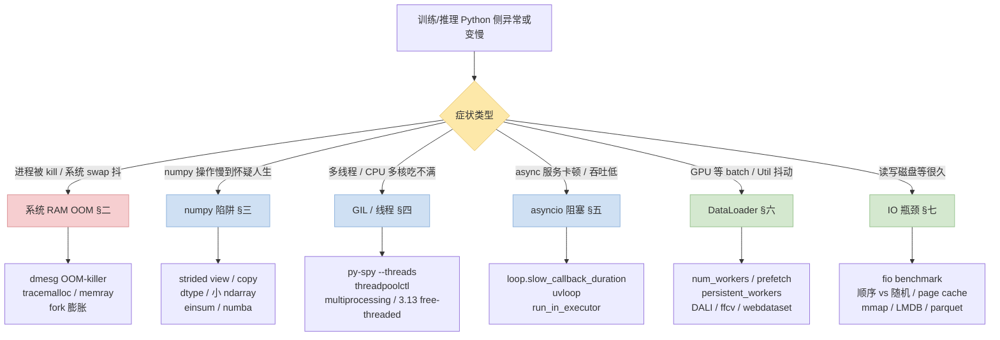
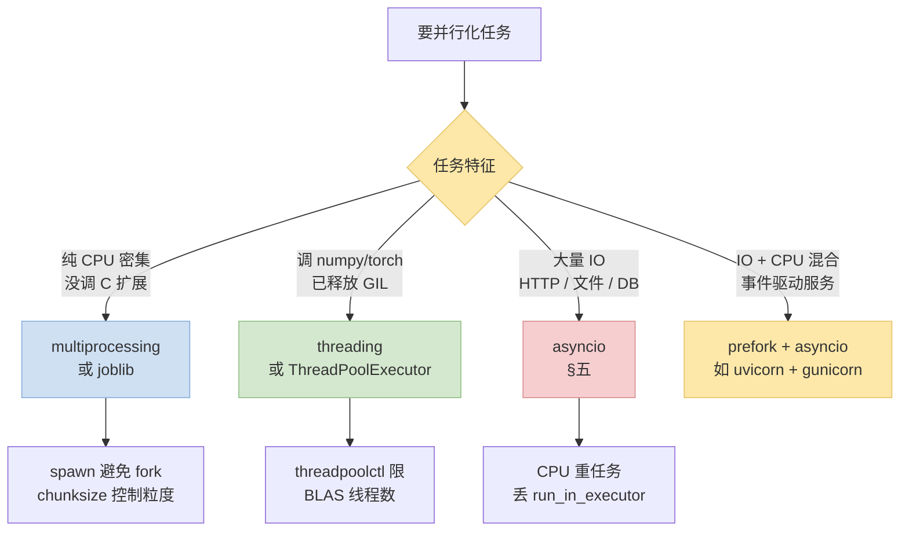
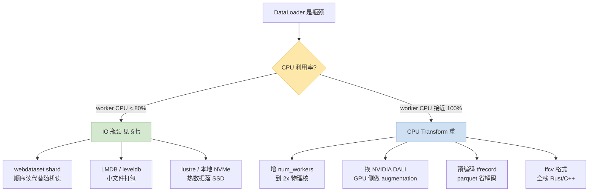
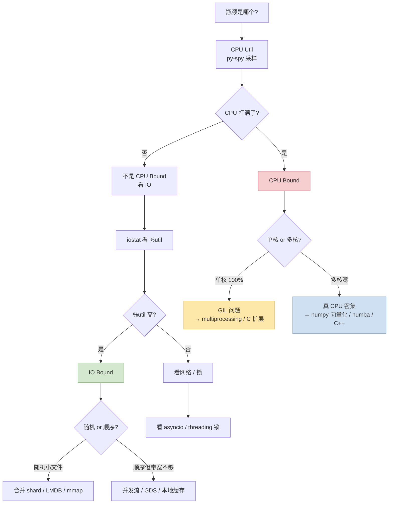

> 这是"训推加速三部曲"的 **CPU 侧补完**：
>
> 1. [高效 CLI 工具栈](/posts/2026-05-07-training-inference-engineer-cli-toolkit.html) —— 讲工具
> 2. [训推加速问题定位 SOP (GPU/NCCL 侧)](/posts/2026-05-07-training-inference-acceleration-troubleshooting-sop.html) —— 讲 CUDA kernel / NCCL / torch.compile
> 3. **本篇** —— 讲系统 RAM OOM / numpy / GIL / asyncio / DataLoader / IO
>
> 做训推的人经常"**GPU 看得很熟、Python 侧当黑盒**"。结果训练一卡顿就反射性去看 nvidia-smi，却忘了 CPU 端的 DataLoader worker 死锁、numpy 奇葩 stride、GIL 抢占、asyncio 阻塞——这些才是大多数"非 CUDA 错"的根源。
>
> 这篇把 Python 侧 6 大类瓶颈的诊断 SOP + 权威参考 + 可直接粘进 AGENTS.md 的 Agent 诊断指引一次整理清楚。

---

## 零、本文骨架

| 小节 | 主题 | 产出形式 |
|---|---|---|
| §一 | 症状 → 根因决策总图 | mermaid + HF pastel 配色 |
| §二 | 系统 RAM OOM（不同于 GPU OOM） | OOM killer 日志 / tracemalloc / memray / fork vs spawn 决策 |
| §三 | numpy 性能陷阱 | strided view / dtype / broadcasting / einsum / numba |
| §四 | GIL & 多线程 | py-spy threads / threadpoolctl / 3.13 free-threaded |
| §五 | asyncio 阻塞问题 | 事件循环 sequence 图 / uvloop / sync-in-async |
| §六 | DataLoader 预处理瓶颈 | gantt 时序图 / num_workers / DALI / ffcv / webdataset |
| §七 | IO 瓶颈 | fio / dd / 随机 vs 顺序 / mmap / LMDB / GDS |
| §八 | CPU bound vs IO bound 决策树 | 选型 mermaid |
| §九 | Agent 版诊断指引 | 可粘进 AGENTS.md 的规则 |
| §十 | 权威资料速查 | 分类索引 |

### 通用体检 cheat sheet（任何症状先跑）

```bash
free -g                              # 系统内存 / swap 水位
vmstat 1 5                           # si/so 有频繁分页 = swap 抖
top -b -n 1 | head -30               # 找占 CPU / MEM 大户
cat /proc/$PID/status | rg -i "Vm|Threads"   # 进程内存 + 线程数
cat /proc/$PID/io                    # 累积 IO 字节
iostat -xm 1 3                       # 每盘 IO 利用率 / await
py-spy dump --pid $PID               # 进程当前所有线程的 Python 栈
py-spy top --pid $PID                # 采样式 top（agent 不要用，TUI）
dmesg -T | rg -i "oom\|killed\|fault" | tail -30   # 内核杀进程 / 故障
```

---

## 一、症状 → 根因决策总图



---

## 二、系统 RAM OOM（**不是** GPU OOM）

**症状**：进程被 OS 悄悄 `SIGKILL` 掉、日志什么都没留、`free -g` 看内存满了、`dmesg` 里有 `oom-killer`、训练 / 推理服务隔一段时间就重启。

### 2.1 第一条命令：`dmesg` 看 OOM killer

```bash
dmesg -T | rg -A 5 -i "oom-killer|out of memory|killed process"
```

典型输出：

```
[Wed May  7] python invoked oom-killer: gfp_mask=0x100cca ...
[Wed May  7] Out of memory: Killed process 12345 (python)
                total-vm:256GB, anon-rss:245GB, file-rss:0kB, ...
```

**`anon-rss` 字段是核心证据**——那是进程实际占用的物理内存。

### 2.2 分诊表

| 特征 | 典型根因 | 定位工具 | 修复方向 |
|---|---|---|---|
| 进程启动就被杀 | dataset 一次性全量读入 RAM | `tracemalloc` + peak snapshot | 流式读取 / `mmap` / `chunksize` |
| 跑着跑着越来越大 | 内存泄漏（大 list append / 全局 cache） | `memray run --live-remote` | 定位泄漏点 + `weakref` / `functools.lru_cache` 限 size |
| `DataLoader` worker 启动后立刻 OOM | fork 复制父进程大对象 | `multiprocessing.set_start_method('spawn')` | 用 `spawn` 或把大对象放到 shared memory |
| 多 rank 训练每个 rank 都爆 | 每个 rank 都加载完整 dataset | 检查 rank-aware sharding | `DistributedSampler` / webdataset shard |
| 推理服务 P99 突增后被杀 | 请求长尾输入导致 allocator 爆 | Prometheus RSS 曲线 | 限 max_seq_len + circuit breaker |
| Free 够但还 OOM | 显存 / pinned memory 算到 RSS | `cat /proc/$PID/smaps_rollup` | 限制 `pin_memory` 总量 |

### 2.3 工具链

**tracemalloc（标准库，轻量）**：

```python
import tracemalloc
tracemalloc.start(10)   # 最多保留 10 层栈

# ... run suspicious code ...

snap = tracemalloc.take_snapshot()
top = snap.statistics('lineno')
for stat in top[:15]:
    print(stat)
```

**memray（Bloomberg 出品，火焰图强）**：

```bash
pip install memray

# 1. 全程 attach（会慢 2x，定位时用）
memray run --live-remote -o mem.bin train.py

# 2. 离线火焰图
memray run -o mem.bin train.py
memray flamegraph mem.bin  # 产出 HTML，浏览器打开

# 3. 跟踪已运行进程（不用重启）
memray attach $PID
```


*图：memray 输出的内存火焰图——条的宽度是当前时刻的内存占用，颜色区分模块。看到某个函数条子持续变宽就是泄漏源头。来源：bloomberg/memray GitHub*

### 2.4 关键陷阱：`fork` 模式下的 copy-on-write 膨胀

Linux 默认 `fork()`，子进程共享父进程内存，写时才复制。**但 Python 的引用计数在每次访问对象时都会写对象头**——导致 read-only 访问也触发 COW，复制到每个 worker。

症状：N 个 DataLoader worker 之后 RSS 几乎翻 N 倍。

**修复三选一**：

```python
# 方案 1：改用 spawn (最彻底，但启动慢)
import torch.multiprocessing as mp
mp.set_start_method('spawn', force=True)

# 方案 2：大对象放 shared_memory (Python 3.8+)
from multiprocessing import shared_memory
shm = shared_memory.SharedMemory(create=True, size=nbytes)

# 方案 3：gc.freeze() 让老生代不参与 COW (Python 3.7+)
import gc; gc.freeze()       # 主进程 fork 前调用
```

### 2.5 权威参考

- [Linux Kernel — OOM Killer 文档](https://www.kernel.org/doc/gorman/html/understand/understand016.html)
- [Python tracemalloc 文档](https://docs.python.org/3/library/tracemalloc.html)
- [Instagram 工程博客 — Copy-on-Write Friendly Python GC](https://instagram-engineering.com/copy-on-write-friendly-python-garbage-collection-ad6ed5233ddf)
- [memray GitHub](https://github.com/bloomberg/memray)
- [Itamar Turner-Trauring — Fil memory profiler](https://pythonspeed.com/fil/)

---

## 三、numpy 性能陷阱

**症状**：一段"应该很快"的 numpy 代码慢到离谱；dtype 莫名其妙翻倍；`.sum()` 比 `@` 乘法还慢；以为零拷贝其实在疯狂 `memcpy`。

### 3.1 Strided view 与隐藏的 copy

numpy 数组是**一块连续内存 + stride 元数据**。切片、转置都是返回 view（零拷贝）；但某些操作会**悄悄 copy** 到新 buffer。


*图：二维数组在内存中的 row-major (C order, numpy 默认) vs column-major (F order, Fortran/MATLAB 默认) 布局。dot/einsum/BLAS 都假设某种连续布局——不匹配时会先 copy 再算。来源：Wikimedia Commons*

**常见隐式 copy 场景**：

```python
import numpy as np
a = np.random.randn(10_000, 10_000)       # C-contiguous

a.T                                        # 仅改 stride，零拷贝 (但变 F-contiguous)
a.T.sum(axis=0)                            # OK
a.T.copy()                                 # 显式 copy
np.ascontiguousarray(a.T)                  # 强制 C-contiguous (会 copy)

a[::2]                                     # 零拷贝 view
a[np.array([1, 3, 5])]                     # fancy indexing → copy!
a[a > 0]                                   # boolean mask → copy!

a.reshape(100, -1)                         # 能做 view 就 view，不能就 copy
a.flatten()                                # 总是 copy
a.ravel()                                  # 能 view 就 view

np.concatenate([a, b])                     # copy 到新 buffer
np.stack / np.vstack / np.hstack          # 同上
```

**验证零拷贝**：

```python
b = a.T
print(b.base is a)         # True = b 是 a 的 view
print(b.flags['OWNDATA'])  # False = 不拥有数据
```

### 3.2 dtype 选错：内存 & 速度翻倍

```python
# 常见错：int 默认 int64
idx = np.arange(10_000_000)           # int64，80 MB
idx = np.arange(10_000_000, dtype=np.int32)   # int32，40 MB

# bool mask 用 uint8 压缩
mask = (a > 0).astype(np.uint8)       # 1 byte/元素，不是 bool
```

**规则**：

- 下游 GPU 是 fp32/bf16 → 上游 numpy 就不该用 fp64
- 索引 / 计数 → `int32` 够用，除非 > 20 亿
- bool mask 稠密时 → `uint8` 更省

### 3.3 Broadcasting：好与不好

Broadcasting 是 numpy 的核心优雅，但**规则错会出天价内存**：


*图：1D 数组 + 2D 数组的 broadcasting——右侧 (1,3) 在概念上"展开"成 (4,3)，实际实现是零拷贝的 stride=0。来源：numpy.org 官方文档*


*图：行向量 (1,3) + 列向量 (4,1) → 外积 (4,3)。numpy 不会真的复制，但很多新手会手动 `np.tile()`——那才会真 copy。来源：numpy.org 官方文档*

**反模式**：

```python
# ❌ 先 tile 再加
B = np.tile(v, (N, 1))        # N×D 真 copy
out = A + B

# ✅ broadcasting (零拷贝)
out = A + v                   # v 自动 broadcast
```

### 3.4 `einsum` 比你想的慢 / 快

- **慢的情况**：`np.einsum('ij,jk->ik', A, B)` 默认不调 BLAS！比 `A @ B` 慢 10~100 倍
- **修复**：`np.einsum('ij,jk->ik', A, B, optimize='greedy')` 或者 **直接用 `@`**

### 3.5 小 ndarray 的 Python 开销

numpy 每次调用都有 ~1μs 的 Python/C 边界开销。**大量 < 100 元素的 ndarray 操作比 Python list 还慢**。

```python
# 在循环里 100 万次做 "(a + b) * c"，每次只有 3 个元素
# numpy: ~5 秒（瓶颈在 Python ↔ C 边界）
# pure python: ~0.8 秒
# numba: ~0.05 秒
```

**修复**：
- 堆起来批处理（batch operation）
- 小操作用 `numba.jit(nopython=True)` 或 `cython`
- 纯 Python 数学用 `math` 模块而非 numpy scalar

### 3.6 快速加速：numexpr / numba / BLAS 线程

```python
# 1. numexpr — 大 ndarray 元素级表达式，省中间 buffer
import numexpr as ne
result = ne.evaluate("a*b + c*d")      # 比 numpy 快 2~4x

# 2. numba — JIT compile 小循环
from numba import njit
@njit(cache=True, parallel=True)
def my_kernel(x):
    ...

# 3. 限制 BLAS 线程数（DataLoader worker 里必做）
import threadpoolctl
threadpoolctl.threadpool_limits(limits=1)   # 避免 N×M 线程爆炸
# 或 env: OMP_NUM_THREADS=1 MKL_NUM_THREADS=1
```

### 3.7 权威参考

- [numpy Broadcasting 文档](https://numpy.org/doc/stable/user/basics.broadcasting.html)
- [numpy Performance Tips](https://numpy.org/doc/stable/user/troubleshooting.html)
- [numpy Advanced Indexing](https://numpy.org/doc/stable/user/basics.indexing.html)
- [Ivan Ogasawara — numpy is not always the fastest way](https://pythonspeed.com/articles/)
- [numba documentation](https://numba.readthedocs.io/)
- [threadpoolctl GitHub](https://github.com/joblib/threadpoolctl)

---

## 四、GIL 与多线程

**症状**：开了 N 个 Python 线程，CPU 只跑满 1 个核；`htop` 上好几个 Python 进程都在"跑"但总吞吐 == 单核。

### 4.1 一句话理解 GIL

Python 解释器有一把全局锁，**任意时刻只有一个线程在跑 Python bytecode**。这意味着：

- **纯 Python CPU 密集 + threading = 无加速**（甚至更慢，因为有切换开销）
- **调用 C 扩展且扩展主动释放 GIL** → **threading 能加速**（numpy / torch / scipy 大部分 C 函数都会释放 GIL）
- **IO 操作 / `time.sleep` → 释放 GIL** → threading 能并发

### 4.2 诊断：哪个线程在啃 GIL

```bash
# py-spy 看多线程：默认只显示主线程，加 --threads 才看全部
py-spy dump --pid $PID                     # 所有线程当前栈
py-spy record --threads -o flame.svg --pid $PID --duration 30

# GIL 持有率分析（Python 3.12+）
python -X frozen_modules=off -c "
import sys, threading
print(sys.monitoring, threading.active_count())
"
```

### 4.3 决策树：threading vs multiprocessing vs asyncio



### 4.4 线程池过度嵌套：BLAS 爆炸

**典型惨案**：N 个 DataLoader worker × 每个 worker 里 numpy 起 M 个 OMP 线程 = **N×M 线程争夺 CPU**，比单核还慢。

```python
# DataLoader worker 启动时
import os, threadpoolctl
os.environ["OMP_NUM_THREADS"] = "1"
os.environ["MKL_NUM_THREADS"] = "1"
threadpoolctl.threadpool_limits(1)

# PyTorch 对应
torch.set_num_threads(1)
torch.set_num_interop_threads(1)
```

**规则**：
- DataLoader worker 里强制 **每个 worker 1 线程**
- 主进程根据物理核数决定 BLAS 线程（`OMP_NUM_THREADS=$(nproc)` 在非 DataLoader 场景）

### 4.5 Python 3.13 free-threaded 模式（2024 末开始）

- 官方实验性支持**去掉 GIL**（PEP 703）
- `python3.13t` 二进制，需 C 扩展标 `Py_GIL_DISABLED`
- 2026 年 numpy / torch 已部分支持，性能 claim 多线程 CPU 密集下线性扩展
- 推荐：**新项目在 CI 里跑一次 3.13t 观测行为，生产还是 3.11/3.12 稳**

### 4.6 权威参考

- [PEP 703 — Making the Global Interpreter Lock Optional in CPython](https://peps.python.org/pep-0703/)
- [Python 3.13 What's New — Free Threaded Mode](https://docs.python.org/3.13/whatsnew/3.13.html#free-threaded-cpython)
- [Real Python — Python GIL 详解](https://realpython.com/python-gil/)
- [David Beazley — Understanding the Python GIL 演讲](https://www.dabeaz.com/python/UnderstandingGIL.pdf)
- [threadpoolctl 文档](https://github.com/joblib/threadpoolctl)
- [joblib 文档](https://joblib.readthedocs.io/)

---

## 五、asyncio 阻塞问题

**症状**：FastAPI / aiohttp / vLLM serving 的 P99 延迟鬼高，QPS 上不去；明明 `async` 了但没并发感；`loop.slow_callback_duration` 警告刷屏。

### 5.1 事件循环最基本的一句话

**asyncio 是单线程协程调度**。任何一个 `async def` 函数里**不 await 就同步跑**，跑多久整个 event loop 就卡多久。

```mermaid
sequenceDiagram
    autonumber
    participant Client as 客户端
    participant Loop as Event Loop
    participant Task1 as 协程 A (正常)
    participant Task2 as 协程 B (CPU 阻塞)
    participant Task3 as 协程 C (被阻塞)

    Client->>Loop: Req1 到达
    Loop->>Task1: 启动 A
    Task1-->>Loop: await network (让出)
    Client->>Loop: Req2 到达
    Loop->>Task2: 启动 B
    Note over Task2: for i in range(10M):<br/>sync_cpu_work()
    Client->>Loop: Req3 到达
    Note over Loop,Task3: B 一直不让出<br/>C 排队等待
    Task2-->>Loop: 终于返回
    Loop->>Task3: 启动 C
    Task1->>Loop: 响应 1
    Task3->>Loop: 响应 3
    Loop->>Client: 所有请求 P99 被 B 拖高
```

### 5.2 四种典型误用

| 误用 | 症状 | 修复 |
|---|---|---|
| `time.sleep(5)` 写在 async 里 | 整个 loop 卡 5s | 换 `await asyncio.sleep(5)` |
| `requests.get(url)` 同步调用 | 阻塞 loop | 换 `aiohttp` / `httpx.AsyncClient` |
| CPU 重计算 (numpy / json.loads 大文件) | P99 飙升 | `await loop.run_in_executor(...)` |
| `asyncio.sleep(0)` 滥用 / 没必要的 yield | 调度抖动 | 删掉或改用 `asyncio.wait_for` |

### 5.3 诊断工具

```python
# 1. 开内置慢协程告警
loop = asyncio.get_event_loop()
loop.slow_callback_duration = 0.1   # > 100ms 就告警
loop.set_debug(True)                 # 还会记录协程创建 traceback

# 2. py-spy 看 event loop 线程
py-spy dump --pid $PID | rg "selector|_run_once|main"

# 3. aiomonitor (类似 Python console，能实时看所有 task)
pip install aiomonitor
# 然后在代码里 aiomonitor.start_monitor(loop=loop)
# telnet localhost 50101
```

### 5.4 uvloop 一行提速

```python
import uvloop
uvloop.install()                  # 放在 main 最前面
# 或 Python 3.11+:
import asyncio
asyncio.set_event_loop_policy(uvloop.EventLoopPolicy())
```

**效果**：HTTP benchmark 类场景 2~4x 提升。FastAPI / aiohttp / vLLM 都建议开。

### 5.5 asyncio 与 GPU 推理服务

vLLM / SGLang 的架构典型是 **asyncio 主 loop + 单独的 GPU engine 线程**。踩坑点：

- 请求预处理（tokenize）放 loop 里 → 长 prompt 会卡其他请求
  → 改 `run_in_executor`
- 响应 streaming 时每个 chunk 要立即 flush
  → 用 `async for ... yield` 而不是 `asyncio.gather`
- backpressure：`asyncio.Queue(maxsize=N)` 防止队列爆
- 优雅关闭：`server.should_exit = True` + 等 in-flight 请求完成

### 5.6 权威参考

- [Python asyncio 官方文档](https://docs.python.org/3/library/asyncio.html)
- [uvloop GitHub](https://github.com/MagicStack/uvloop)
- [aiohttp 文档](https://docs.aiohttp.org/)
- [httpx AsyncClient 文档](https://www.python-httpx.org/async/)
- [Michael Kennedy — Async Python Techniques (Talk Python Training)](https://training.talkpython.fm/courses/)
- [David Beazley — asyncio 相关的 Curious Course on Coroutines](https://www.dabeaz.com/coroutines/)

---

## 六、DataLoader 预处理瓶颈

**症状**：`nvidia-smi` 看 GPU Util 周期性掉到 0%；训练 step 时间抖得厉害；启动训练时 worker 起半天；`dmesg` 里有 DataLoader 僵尸进程。

### 6.1 DataLoader 流水线时序

```mermaid
gantt
    title DataLoader 理想流水线 (num_workers=4, prefetch_factor=2)
    dateFormat X
    axisFormat %Ls

    section Worker 0
    Load batch 0       :done, w0a, 0, 400
    Load batch 4       :active, w0b, 400, 400
    Load batch 8       :w0c, 800, 400

    section Worker 1
    Load batch 1       :done, w1a, 100, 400
    Load batch 5       :active, w1b, 500, 400
    Load batch 9       :w1c, 900, 400

    section Worker 2
    Load batch 2       :done, w2a, 200, 400
    Load batch 6       :active, w2b, 600, 400

    section Worker 3
    Load batch 3       :done, w3a, 300, 400
    Load batch 7       :active, w3b, 700, 400

    section GPU 训练
    train batch 0      :crit, g0, 400, 200
    train batch 1      :crit, g1, 600, 200
    train batch 2      :crit, g2, 800, 200
    train batch 3      :crit, g3, 1000, 200
```



**关键**：worker 数量 × prefetch 深度 **必须让 GPU 端不等数据**——如果某个条 bar 结束后 GPU 行出现空白，就是 DataLoader bound。

### 6.2 关键参数一张表

| 参数 | 建议值 | 说明 |
|---|---|---|
| `num_workers` | `min(物理核数, 16)` 起跳 | 太高会抢 BLAS 线程；在 H100/A100 上常设 8~16 |
| `prefetch_factor` | 2~4 | 每个 worker 预备 N 个 batch |
| `pin_memory` | `True`（GPU 训练） | pinned RAM → 直接 DMA 到 GPU，减少 memcpy |
| `persistent_workers` | `True` | 每 epoch 不重启 worker，省启动开销 |
| `drop_last` | `True` | 避免最后一个 mini-batch 形状异常触发 recompile |
| `shuffle` | `True`（训练） | 用 `DistributedSampler` 的话这里要 False |
| multiprocessing context | `'spawn'` 或 `'forkserver'` | 避免 fork COW 膨胀 |

### 6.3 常见瓶颈定位

```bash
# 1. 看 worker CPU 是否吃满（应该接近 100% 单核）
pidstat -p $(pgrep -f 'train.py' | tr '\n' ',' | sed 's/,$//') -r -u 1

# 2. 看是否等 IO
iostat -xm 1                  # %util 高 = IO bound
py-spy dump --pid $WORKER_PID # stack 里看到 read() = IO bound

# 3. 关单 worker 重测定位变换耗时
DataLoader(..., num_workers=0)
# 跑几步看每步时间 → 纯单线程 baseline
```

### 6.4 典型修复方案



### 6.5 现代替代：DALI / ffcv / webdataset

| 方案 | 适合 | 加速比 | 难度 |
|---|---|---|---|
| **NVIDIA DALI** | 图像 / 视频 CV | 2~5x | 中（要重写 pipeline DSL） |
| **ffcv** | 图像分类 / 检测 | 5~10x | 高（新数据格式 `.beton`） |
| **webdataset** | 大规模文本 / 多模态 | 顺序读带宽打满 | 低（tar 格式即可） |
| **MosaicML StreamingDataset** | 云对象存储训练 | 提升起步速度 | 中 |
| **Nvidia NVIDIA Merlin HugeCTR** | 推荐系统（大稀疏） | — | 高 |

### 6.6 权威参考

- [PyTorch DataLoader 官方文档](https://pytorch.org/docs/stable/data.html)
- [PyTorch Data Loading Tutorial](https://pytorch.org/tutorials/beginner/data_loading_tutorial.html)
- [NVIDIA DALI 文档](https://docs.nvidia.com/deeplearning/dali/user-guide/docs/)
- [ffcv GitHub](https://github.com/libffcv/ffcv)
- [webdataset GitHub](https://github.com/webdataset/webdataset)
- [HuggingFace Streaming Datasets](https://huggingface.co/docs/datasets/stream)
- [Mosaic StreamingDataset](https://docs.mosaicml.com/projects/streaming/)

---

## 七、IO 瓶颈

**症状**：checkpoint 保存 5 分钟、`torch.load` 卡很久、多 rank 训练每 epoch 开始都挤 NFS、`iostat` `%util` 长期 100%。

### 7.1 理解 Linux IO stack（很多问题不是程序的）


*图：Linux 内核 IO 栈简化版——应用 → VFS → 文件系统 → block layer → 物理设备。任何一层都可能是瓶颈。来源：Wikimedia Commons*

**训推工程师关心的层**：

- **Page cache**：Linux 默认 read-ahead + 写缓存。大 dataset 会把训练数据完整拉进 page cache，**下一次 epoch 超快**——第一次 epoch 慢不一定是问题
- **Block layer scheduler**：HDD 用 `mq-deadline`，NVMe 用 `none` / `kyber`
- **Filesystem**：ext4 / xfs 差异在并发写的元数据锁

### 7.2 第一步：`fio` 测真实带宽

```bash
# 顺序读（模拟 webdataset）
fio --name=seqread --rw=read --bs=1M --size=10G --numjobs=4 \
    --ioengine=libaio --direct=1 --group_reporting

# 随机读（模拟小文件 dataset）
fio --name=randread --rw=randread --bs=4k --size=1G --numjobs=8 \
    --ioengine=libaio --direct=1 --iodepth=32 --group_reporting

# 写（模拟 checkpoint）
fio --name=seqwrite --rw=write --bs=1M --size=10G --numjobs=1 \
    --ioengine=libaio --direct=1 --group_reporting
```

把这 3 个数字记住就能判断"我这 IO 是不是合理"。

### 7.3 随机 vs 顺序：差 10~100 倍

| 访问模式 | NVMe | SATA SSD | HDD | NFS | S3 |
|---|---|---|---|---|---|
| 顺序读 bandwidth | 3~7 GB/s | 500 MB/s | 150 MB/s | 100~1000 MB/s | 100~500 MB/s |
| 随机 4K IOPS | 500K~1M | 70K | 150 | 1K~10K | 100~1K |

**关键推论**：

- 训练数据**能顺序读就千万别随机读**—— webdataset / tar / parquet / tfrecord 都是为此设计
- 小图片 10 万个文件 → LMDB / HDF5 / zip 打包
- 云存储（S3 / OSS）**随机读极慢**——一定要用 prefetch + 聚合 shard

### 7.4 典型坑速查

| 症状 | 根因 | 修复 |
|---|---|---|
| checkpoint 写 5 分钟 | `torch.save` 单线程 pickle | `torch.save(..., _use_new_zipfile=True)` + NVMe 本地 |
| 同上但在 NFS | NFS 写 fsync 慢 | 先写本地 → `rsync` 到 NFS |
| 每 epoch 开始慢 | Page cache 被挤掉 | `vmtouch` 手动固定 / 用 BeeGFS 缓存层 |
| 多 rank 同时读 | 元数据服务器压力 | shard 按 rank 本地化 / 预分发 |
| HF `datasets` 卡住 | lock 文件争抢 | `cache_dir` 拆 rank-local |
| `torch.load` 长时间 | unpickle 反序列化慢 | 用 `safetensors` / `mmap_mode='r'` |

### 7.5 mmap + 零拷贝

```python
# torch 模型 mmap 加载（PyTorch 2.3+）
model = torch.load("ckpt.pt", mmap=True, weights_only=True)

# safetensors（强烈推荐）
from safetensors.torch import load_file
state = load_file("model.safetensors", device="cuda")   # 真 mmap

# numpy mmap
arr = np.load("data.npy", mmap_mode="r")   # 不占 RAM
```

### 7.6 GPUDirect Storage（GDS）

- **是什么**：NVIDIA 的特性，让 GPU 直接从 NVMe/远程存储 DMA，绕过 CPU + page cache
- **用哪**：PyTorch 原生不支持，需 `cuFile` 或 NVIDIA DALI GDS 模式
- **收益**：20~80% 数据路径延迟下降，大模型推理加载场景明显
- **坑**：需内核模块 `nvidia-fs`，文件系统也要 GDS-aware（Lustre / WekaFS / DDN 等）

### 7.7 权威参考

- [Brendan Gregg — Linux Performance](https://www.brendangregg.com/linuxperf.html)
- [fio 官方文档](https://fio.readthedocs.io/)
- [Linux Storage Stack Diagram](https://www.thomas-krenn.com/en/wiki/Linux_Storage_Stack_Diagram)
- [PyTorch safetensors 官方集成](https://huggingface.co/docs/safetensors)
- [NVIDIA GPUDirect Storage](https://docs.nvidia.com/gpudirect-storage/index.html)
- [HuggingFace datasets IO Tips](https://huggingface.co/docs/datasets/cache)

---

## 八、CPU Bound vs IO Bound：一张导图



---

## 九、给 AI Agent 的 CPU 侧诊断指引

配合 [CLI toolkit §11 Agent 规则](/posts/2026-05-07-training-inference-engineer-cli-toolkit.html#十一给-ai-agent-的-cli-优先使用指引)、[GPU 侧 SOP](/posts/2026-05-07-training-inference-acceleration-troubleshooting-sop.html)，把下面这段粘进 `AGENTS.md`：

````markdown
# Python 侧性能瓶颈 Triage 规则

当用户报告 "训练慢 / 服务慢 / 进程被 kill / DataLoader 卡 / 读盘慢" 时：

1. **先跑体检（无脑版）**：
   - `free -g && vmstat 1 3`
   - `dmesg -T | rg -i "oom|killed" | tail -20`
   - `iostat -xm 1 3`
   - `py-spy dump --pid $PID` （每个嫌疑进程）
   - `cat /proc/$PID/status | rg -i "Vm|Threads|State"`

2. **按证据锁定分支**：
   - dmesg 有 OOM → §二（系统 RAM）
   - numpy 在栈里占 >30% → §三
   - py-spy 显示同一堆栈多线程等锁 → §四 GIL
   - FastAPI / aiohttp 进程 → §五 asyncio
   - stack 里看到 DataLoader worker → §六
   - iostat %util 100% → §七

3. **产出格式**（强制）：
   | 症状 | 证据（具体数字） | 根因 | 修复 | 验证方法 |
   |---|---|---|---|---|

4. **禁止**：
   - 直接加 `num_workers` 到 64（得先测）
   - 改 `multiprocessing.set_start_method` 而不说清楚副作用
   - 在报告里用"可能"、"可能是"——要给证据

5. **每条建议必须带权威参考链接**（PyTorch 官方 / numpy 官方 / PEP / Brendan Gregg）

6. **特殊禁用工具**（agent 无 TTY）：
   - `htop` / `btop` / `py-spy top` / `memray run --live` （要用 `--live-remote` 版本）
   - 任何 curses 界面
````

---

## 十、权威资料速查

| 主题 | 权威资料 |
|---|---|
| **Python 官方** | [Python tracemalloc](https://docs.python.org/3/library/tracemalloc.html) · [asyncio docs](https://docs.python.org/3/library/asyncio.html) · [PEP 703 (no-GIL)](https://peps.python.org/pep-0703/) |
| **numpy** | [Broadcasting](https://numpy.org/doc/stable/user/basics.broadcasting.html) · [Advanced Indexing](https://numpy.org/doc/stable/user/basics.indexing.html) · [Performance Tips](https://numpy.org/doc/stable/user/troubleshooting.html) |
| **Profiling** | [memray](https://github.com/bloomberg/memray) · [py-spy](https://github.com/benfred/py-spy) · [scalene](https://github.com/plasma-umass/scalene) · [Fil](https://pythonspeed.com/fil/) |
| **多进程 / 线程** | [threadpoolctl](https://github.com/joblib/threadpoolctl) · [joblib](https://joblib.readthedocs.io/) · [Real Python — GIL](https://realpython.com/python-gil/) · [Dabeaz GIL PDF](https://www.dabeaz.com/python/UnderstandingGIL.pdf) |
| **asyncio** | [uvloop](https://github.com/MagicStack/uvloop) · [aiohttp](https://docs.aiohttp.org/) · [httpx](https://www.python-httpx.org/) · [aiomonitor](https://github.com/aio-libs/aiomonitor) |
| **DataLoader** | [PyTorch DataLoader](https://pytorch.org/docs/stable/data.html) · [DALI](https://docs.nvidia.com/deeplearning/dali/user-guide/docs/) · [ffcv](https://github.com/libffcv/ffcv) · [webdataset](https://github.com/webdataset/webdataset) |
| **IO 调优** | [fio 文档](https://fio.readthedocs.io/) · [Brendan Gregg — Linux Perf](https://www.brendangregg.com/linuxperf.html) · [GDS](https://docs.nvidia.com/gpudirect-storage/index.html) · [safetensors](https://huggingface.co/docs/safetensors) |
| **Fork / COW** | [Instagram COW-friendly GC](https://instagram-engineering.com/copy-on-write-friendly-python-garbage-collection-ad6ed5233ddf) · [Python `gc.freeze()` 文档](https://docs.python.org/3/library/gc.html#gc.freeze) |
| **加速库** | [numba](https://numba.readthedocs.io/) · [numexpr](https://numexpr.readthedocs.io/) · [cython](https://cython.readthedocs.io/) · [mojo (2024+)](https://www.modular.com/mojo) |
| **速读博客** | [Pythonspeed.com (Itamar Turner-Trauring)](https://pythonspeed.com/) · [Ned Batchelder](https://nedbatchelder.com/) · [Dan Luu](https://danluu.com/) |

---

## 十一、相关文章

- [训推工程师 & AI Agent 时代的高效 CLI 工具栈](/posts/2026-05-07-training-inference-engineer-cli-toolkit.html) —— 讲工具
- [训推加速问题定位 SOP（GPU/NCCL 侧）](/posts/2026-05-07-training-inference-acceleration-troubleshooting-sop.html) —— 讲 CUDA/NCCL/compile
- 本文 —— 讲 Python CPU 侧（系统 OOM / numpy / GIL / asyncio / DataLoader / IO）

三篇一起构成 2026 年训推工程师的**完整排障 playbook**。

---

> **一句话总结**：90% 的"GPU 在等"其实是 Python 在忙——忙着被 GIL 挡住、忙着 copy numpy、忙着 fork 膨胀、忙着随机读小文件。先看 CPU 侧，GPU 自然就满了。
