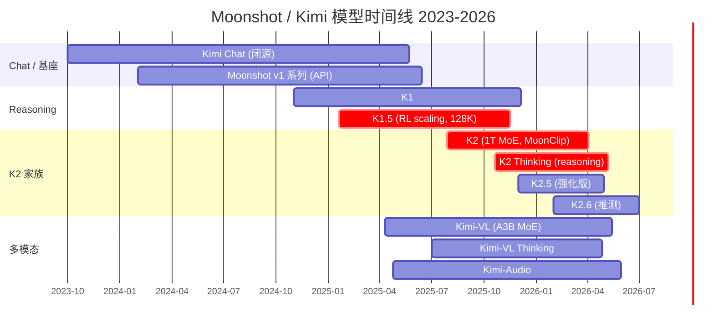
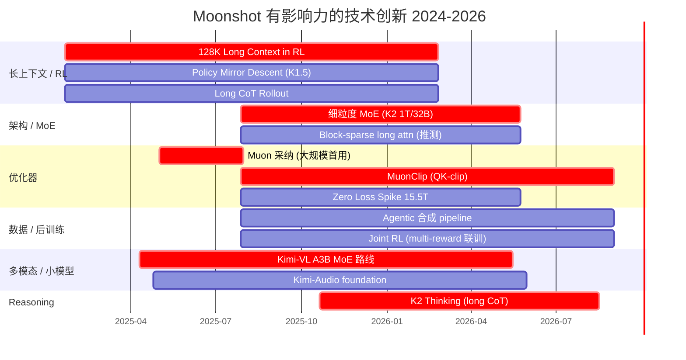
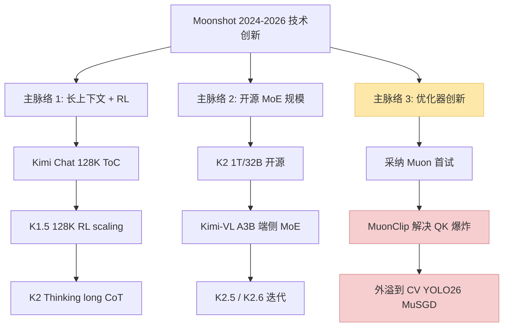
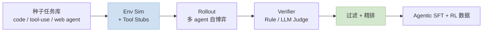

> **⚠️ WIP 声明**：这是一篇逐步补全的**公司技术洞察 WIP 博文**。内容基于公开论文 / 技术报告 / HuggingFace / GitHub 的可核实材料整理，**细节以 Moonshot 官方发布为准**。时间轴推进中，部分推测标注"(推测)"。
>
> 姊妹篇：[训推加速技术地图](/posts/2026-05-08-training-inference-acceleration-map.html) · [MoE 训练加速](/posts/2026-05-08-moe-training-acceleration-deepep-qwen3.html) · [RL 训练加速](/posts/2026-05-08-rl-training-qwen3-vllm-verl.html)
>
> **最后更新：2026-05-08**

---

## 零、一句话背景

Moonshot AI（月之暗面）创立于 2023，杨植麟等清华背景创始团队，产品品牌 **Kimi**。2024~2025 靠 **长上下文（128K ~ 200K）** 和 **Kimi Chat** 打响中国市场，2025 年 Q3 开源 **K2（1T MoE）** 进入全球开源最前排，独创 **MuonClip 优化器** 是目前 2026 最受关注的训练侧创新之一。

---

## 一、产品 & 模型时间线

### 1.1 核心产品对照

| 发布 | 模型 | 参数 | 定位 | 开源 |
|---|---|---|---|---|
| 2023 Q4 | Kimi Chat | 闭源 | 长上下文 ToC 对话 | ❌ |
| 2024 Q4 | K1 | 闭源 | 推理雏形 | ❌ |
| **2025-01** | **K1.5** | 闭源（有技术报告） | **RL + 128K reasoning** | 部分（技术报告 + 代码片段）|
| 2025-04 | Kimi-VL | **A3B MoE**（3B active） | 多模态小模型 | ✅ 权重 |
| 2025-04 | Kimi-Audio | 7B | 音频 foundation | ✅ 权重 |
| **2025-07** | **K2** | **1T / 32B active MoE** | **开源旗舰 agentic** | ✅ 权重 + 技术报告 |
| 2025-10 | K2 Thinking | 同基座 | 长 reasoning 变体 | ✅ |
| 2025-12 | K2.5 | 推测与 K2 同量级 | 强化 | ✅ 权重 |

---

## 一·五、技术创新时间线（有影响力的创新点 + 关联论文）

### 1.5.1 时间线

### 1.5.2 创新点清单：按影响力排序

| # | 创新点 | 所在模型 | 关联论文 / 来源 | 业界影响 |
|---|---|---|---|---|
| **1** | **MuonClip 优化器**（Muon + QK-clip）| K2 | [K2 报告 (2507.20534)](https://arxiv.org/abs/2507.20534) · [Muon 原文](https://kellerjordan.github.io/posts/muon/) | **Adam 之后被讨论最多的优化器**；YOLO26 的 **MuSGD** 直接点名引用 |
| **2** | **15.5T tokens Zero Loss Spike** | K2 | K2 报告 §3 | 1T MoE 训练稳定性里程碑，证明 Muon 系可驾驭 |
| **3** | **长上下文 + RL Scaling** | K1.5 | [K1.5 (2501.12599)](https://arxiv.org/abs/2501.12599) | 与 OpenAI o1 同期，**开源第一个证明 RL 可 scale 到 128K CoT** |
| **4** | **Policy Mirror Descent (PMD) 替代 PPO** | K1.5 | K1.5 报告 §4 | 为 RL 稳定性提供新思路 |
| **5** | **Agentic 大规模数据合成** | K2 | K2 报告 §5 | 开源 SWE-Bench Verified 65.8，被 veRL / OpenRLHF 借鉴 |
| **6** | **Joint RL 多 reward 联合训练** | K2 | K2 报告 §5.3 | 避免多阶段漂移 |
| **7** | **1T / 32B 细粒度 MoE 开源** | K2 | K2 报告 §2 | 和 DeepSeek-V3 671B/37B 共撑开源 MoE 天花板 |
| **8** | **A3B MoE 小模型多模态路线** | Kimi-VL | [Kimi-VL 报告 (2504.07491)](https://arxiv.org/abs/2504.07491) | MoE 做端侧 VLM 的典型，和 Gemma 3n / MiniCPM-o 形成三足 |
| **9** | **Kimi-Audio foundation** | Kimi-Audio | [GitHub](https://github.com/MoonshotAI/Kimi-Audio) | 开源音频 LLM 栈，和 Qwen2.5-Omni 同期 |
| **10** | **K2 Thinking 长 CoT 推理** | K2-Thinking | [HF model card](https://huggingface.co/moonshotai/Kimi-K2-Thinking) | 开源 reasoning 重要节点 |

### 1.5.3 三条主脉络

**影响力最大的一条**：**优化器主脉络（Muon → MuonClip → MuSGD 外溢）**——这是 2026 能看到跨领域传播的 LLM 技术。

---

## 二、核心结构创新

### 2.1 K2：1T MoE 架构

根据 K2 技术报告（arxiv 2507.20534）：

- **总参数 1T，激活 32B**（top-k activation）
- Mixture-of-Experts，**精细粒度专家**（跟随 DeepSeek-V3 路线）
- **15.5T tokens 预训练**，声称**全程 zero loss spike**（稳定性的重要 selling point）
- Post-training：多阶段 + **大规模 agentic 数据合成** + **联合 RL**

### 2.2 Kimi-VL：A3B MoE 小模型路线

Kimi-VL-A3B（A = activated）：
- 总参 ~16B，激活 ~2.8B
- MoE 做小模型的代表工作之一
- 支持 image / video / OCR / 多轮视觉推理
- Thinking 变体延续 K2 Thinking 的 long CoT

### 2.3 K1.5：Scaling RL with LLMs

K1.5 技术报告（arxiv 2501.12599）讲的不是架构而是 **RL 配方**：
- **128K 上下文** 下做 long reasoning RL
- **Policy Mirror Descent**（改 PPO 稳定性）
- Rollout 长 CoT 轨迹 + reward shaping
- 与 OpenAI o1 同期，给开源社区"**RL 真的 scale**"的第二例证

---

## 三、优化器创新：Muon → MuonClip

这是 Moonshot 对 LLM 训练领域影响最大的贡献，值得单独拿出来说。

### 3.1 Muon 背景

**Muon**（Jordan Keller 等 2024）是基于 **正交化 momentum**（Newton-Schulz 矩阵迭代）的优化器：

$$
M_t = \beta M_{t-1} + G_t, \quad O_t = \mathrm{NewtonSchulz}(M_t), \quad \theta_{t+1} = \theta_t - \eta \, O_t
$$

相比 AdamW 的优点：
- **Token efficiency 高**（同样 step 学到更多）
- 对宽层（hidden_dim 大）效果尤其好
- 内存只需 momentum（比 Adam 省一倍）

缺点：**大规模训练不稳定**——Attention logit 容易爆。

### 3.2 MuonClip：Muon + QK-Clip

K2 的核心创新。**问题诊断**：Muon 训练大 MoE 时，某些 token 的 Q·K logit 会异常大，softmax 饱和 → loss spike。

**解决**：在 Q 和 K 的 projection 权重上加 **per-head max-norm clip**：

$$
W_Q \leftarrow W_Q \cdot \min\left(1, \frac{\tau}{\|W_Q\|_\text{max-head}}\right)
$$

- $\tau$：可学习或 schedule 的阈值
- 在 **每步优化之后**施加，不改前向
- 本质是**把不稳定源限制在数值范围内**

**效果**（K2 报告）：
- **15.5T tokens 预训练 zero spike**（这在 1T MoE 规模是 landmark）
- 保住 Muon 的 token efficiency
- 对 attention 数值稳定性提供直接约束

### 3.3 MuonClip 的行业影响

2025~2026 迅速外溢：
- **YOLO26**（Ultralytics, 2025 Q3）的 **MuSGD 优化器**（SGD + Muon 混合）直接点名 Kimi K2 为灵感来源
- 多个开源 MoE 训练栈集成 Muon/MuonClip（Megatron-LM、NanoGPT 社区）
- **成为 2026 年 Adam 之后最被讨论的替代优化器**

---

## 四、训练工程创新

### 4.1 Zero Loss Spike 的工程意义

1T 模型训练最贵的不是算力，而是**炸炉重启**。K2 声称 15.5T token 全程没炸过，意味着：
- MuonClip + 并行策略 + 学习率 schedule 高度协同
- **训练 MFU 接近理论上限**（无 rollback 损失）
- 同等预算可多训 10~20% 有效 token

### 4.2 Agentic 数据合成 Pipeline

K2 的后训练最大贡献之一是 **大规模 agentic 轨迹合成**：

- 工具使用、多跳 web 交互、代码 agent 三条主线
- 合成数据 + 真实轨迹混训
- 对应评测：Tau2-Bench 66.1 / ACEBench 76.5 / SWE-Bench Verified 65.8（非 thinking）

### 4.3 Joint RL Stage

K2 的 post-training 把多种 RL reward 信号**联合**训练：
- Rule-based reward（代码通过单测 / 数学答案对）
- RM reward（对话质量）
- Agentic reward（任务完成度）

避免"先 SFT 再 RL"多阶段漂移，**一次 joint 训练**更稳。

### 4.4 长上下文训练：K1.5 的 128K 配方

- **YARN / RoPE 外推**做位置编码扩展
- **Chunk-based RL rollout**：长 CoT 轨迹切块训练
- **Flash Attention + Sequence Parallel** 必备
- 内存账本：128K × 32B active ≈ 需要 ZeRO-3 + activation checkpointing

---

## 五、推理工程创新

### 5.1 K2 的推理挑战

1T MoE 推理不是 trivial 工程：
- **专家路由 + EP 并行** 必备
- 部署默认走 **vLLM / SGLang + DeepEP** 风格 all-to-all
- Moonshot 内部推理栈未完全开源，但 HuggingFace 权重 + vLLM v0.7+ 已支持

### 5.2 MoE 推理特化

K2 推理栈的（社区推测 + 部分可见）关键点：
- **FP8 权重**（HF 有 FP8 variant）
- **Block-sparse attention** on long context
- **Prefix Cache**：agent 场景同 system prompt 复用
- **Speculative Decoding**：社区已有 EAGLE/ Medusa 适配

### 5.3 K2 Thinking 的长 CoT 推理

Thinking 变体输出可达数万 token 链路：
- **流式输出 + 思维段折叠** UI
- 推理时 reasoning budget 可调
- 和 OpenAI o-series / Qwen Thinking 路线类似

### 5.4 开源生态集成

截至 2026-05：
- vLLM（原生支持 K2 MoE）
- SGLang（Agentic tool-use 首选）
- llama.cpp（Q4/Q5 量化跑单机 256GB CPU 也能跑 K2）
- NVIDIA NeMo-AutoModel（Kimi-VL 官方集成）

---

## 六、Benchmark 摘要

K2 非 thinking 设置（来自官方报告）：

| Benchmark | K2 | 意义 |
|---|---|---|
| Tau2-Bench | 66.1 | Agentic 工具使用 |
| ACEBench (En) | 76.5 | 多步工具调用 |
| SWE-Bench Verified | 65.8 | 代码 agent |
| SWE-Bench Multilingual | 47.3 | 跨语言代码 |
| LiveCodeBench v6 | 53.7 | 实时编程 |

**2025 Q3 数据**表明 K2 在开源 agentic 场景**接近甚至超过 Claude 3.5 Sonnet**（非 thinking），是开源社区的里程碑。

K2 Thinking 在数学 / reasoning benchmark 上再加一档（AIME / GPQA 具体数值需查最新官方 update）。

---

## 七、2026 行业影响洞察

### 7.1 三条影响力主线

1. **MuonClip 成为 Adam 之外最被讨论的优化器** — 已外溢到 CV（YOLO26）
2. **1T MoE 开源标杆** — 把"开源追得上闭源"这件事继续往前推
3. **Agentic 合成数据配方** — 用 RL + 自博弈做 agent 能力的范式被 veRL / OpenRLHF 社区借鉴

### 7.2 与其它开源玩家的对照

| 维度 | Kimi K2 | DeepSeek-V3 | Qwen3-MoE |
|---|---|---|---|
| 规模 | **1T / 32B active** | 671B / 37B active | 235B / 22B active |
| 优化器 | **MuonClip** | AdamW + **Aux-Loss-Free** | AdamW |
| 定位 | **Agentic** | 通用 reasoning | 通用 + 工具 |
| 训练 token | **15.5T** | ~14.8T | ~18T (推测) |
| 独特卖点 | **zero spike + Muon** | FP8 训练 + 细粒度 MoE | 多尺寸家族 |

### 7.3 可能的下一步（观察清单）

- **K3 / 新一代基座**：是否继续押 Muon 路线
- **多模态与 K2 融合**：Kimi-VL Thinking 是否升级到 K2 级别基座
- **端侧 Kimi**：Kimi-VL-A3B 之后是否有更小的 A0.5B / A1B 端侧版本
- **Agent 评测权威化**：Moonshot 是否会推出行业 agent benchmark

---

## 八、WIP：待补充章节

- [ ] K2 技术报告 v2（2026-02 更新）的增量变化详读
- [ ] K2.5 / K2.6 的具体 delta（需官方更多公开）
- [ ] Kimi-VL 的 visual encoder 选型和 MoE 细节
- [ ] Kimi-Audio 的 codec / audio tokenizer 路线
- [ ] MuonClip 在不同 domain（CV / 推荐 / 语音）的实测数据
- [ ] 与 DeepSeek DualPipe / Aux-Loss-Free 的细粒度对照
- [ ] Kimi 推理栈的延迟 / 吞吐 benchmark 横评

---

## 九、权威参考

**Moonshot 官方 & 论文**：
- [Moonshot AI 官网](https://www.moonshot.ai/)
- [Kimi K2 技术报告 (arxiv 2507.20534)](https://arxiv.org/abs/2507.20534)
- [Kimi K2 项目页](https://moonshotai.github.io/Kimi-K2/)
- [Kimi K1.5 技术报告 (arxiv 2501.12599)](https://arxiv.org/abs/2501.12599)
- [Kimi-VL 技术报告 (arxiv 2504.07491)](https://arxiv.org/abs/2504.07491)

**HuggingFace**：
- [moonshotai (组织主页)](https://huggingface.co/moonshotai)
- [Kimi-K2-Thinking](https://huggingface.co/moonshotai/Kimi-K2-Thinking)
- [Kimi-VL-A3B-Instruct](https://huggingface.co/moonshotai/Kimi-VL-A3B-Instruct)

**GitHub**：
- [Kimi-K2](https://github.com/MoonshotAI/Kimi-K2)
- [Kimi-K2.5](https://github.com/MoonshotAI/Kimi-K2.5)
- [Kimi-k1.5](https://github.com/MoonshotAI/kimi-k1.5)
- [Kimi-VL](https://github.com/MoonshotAI/Kimi-VL)
- [Kimi-Audio](https://github.com/MoonshotAI/Kimi-Audio)

**Muon 相关**：
- [Muon 原始讨论 (Jordan Keller, 2024)](https://kellerjordan.github.io/posts/muon/)
- [MuonClip 解读 (Fireworks)](https://fireworks.ai/blog/muonclip)

**第三方分析**：
- [Nathan Lambert — 5 Thoughts on Kimi K2 Thinking](https://www.interconnects.ai/p/kimi-k2-thinking-what-it-means)
- [IntuitionLabs — K2 Technical Deep Dive](https://intuitionlabs.ai/articles/kimi-k2-technical-deep-dive)

**系列文**：
- [训推加速技术地图](/posts/2026-05-08-training-inference-acceleration-map.html)
- [MoE 训练加速](/posts/2026-05-08-moe-training-acceleration-deepep-qwen3.html)
- [RL 训练加速](/posts/2026-05-08-rl-training-qwen3-vllm-verl.html)

---

> **WIP 阶段性总结**：Moonshot Kimi 在 2024~2026 的三条硬技术线——**长上下文（K1.5 128K RL）+ MoE 规模（K2 1T）+ 优化器创新（MuonClip）**。MuonClip 的外溢效应（甚至到 YOLO26 这样的 CV 模型）说明其已跨出 LLM 语境，成为 2026 训练侧最值得关注的优化器创新之一。
