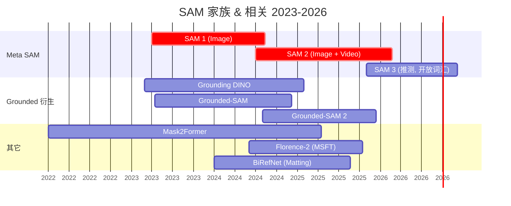
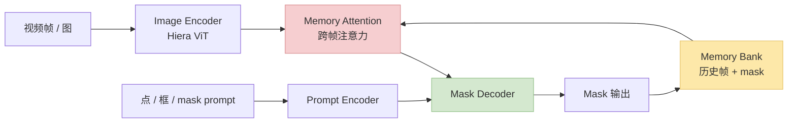
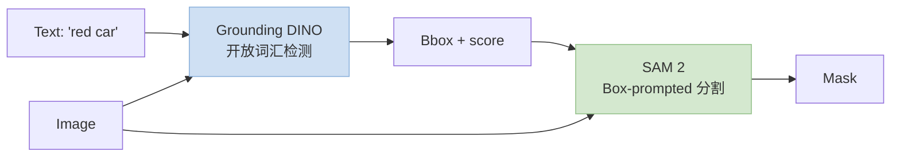
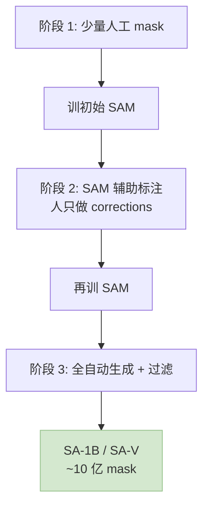

> 训推加速系列深化之"视觉分割"专题。2024 SAM 2 把"可提示分割"从图像扩到视频，2025~2026 Grounded-SAM / Florence-2 / SAM 3 进一步把分割和**开放词汇检测 / VLM** 打通。这一篇讲清 **分割任务的独有加速挑战**（Mask Head / Memory Attention / 视频一致性）和训练端的工程套路。
>
> 姊妹篇：[训推加速技术地图](/posts/2026-05-08-training-inference-acceleration-map.html) · [图像 Diffusion 深化](/posts/2026-05-08-image-diffusion-acceleration-flux-sd3-dmd2.html) · [视频 & 3D 扩散加速](/posts/2026-05-08-video-3d-diffusion-acceleration.html)
>
> ⚠️ **时效声明（最后更新：2026-05-08）**：SAM 2 是 Meta 2024-07 开源，SAM 3 / Grounded-SAM 2 / Florence-2 都是 2024~2025 的新东西，数值为公开资料量级。

---

## 零、本文骨架

| 小节 | 主题 | 产出 |
|---|---|---|
| §一 | 分割 ≠ 检测 ≠ Diffusion | 独特挑战 |
| §二 | SAM 家族演进：SAM 1 → SAM 2 → SAM 3 | 时间线 |
| §三 | SAM 2 架构拆解：Memory Attention | 视频一致性关键 |
| §四 | Grounded-SAM / Florence-2：开放词汇分割 | VLM × SAM |
| §五 | 训练加速：数据引擎 + Mask Head + 长视频 | - |
| §六 | 推理加速：ONNX / TensorRT / 端侧 SAM | - |
| §七 | Matting / 精细化分割 | BiRefNet / MatAnyone |
| §八 | Benchmark：COCO / LVIS / DAVIS / SA-V | - |
| §九 | 2026 SOTA 配置 | - |
| §十 | 权威参考 | - |

---

## 一、分割 ≠ 检测 ≠ Diffusion

### 1.1 独特挑战对比

| 维度 | 检测 (DETR / YOLO) | 分割 (SAM 2 / Mask2Former) | Diffusion (SD3 / Flux) |
|---|---|---|---|
| 输出 | bbox + class | **像素级 mask** | 全图像素 |
| 训练目标 | IoU + 分类 | **Dice / Focal Loss** | Denoising |
| 长时依赖 | 单帧 | **跨帧 memory**（视频）| 单帧 |
| 推理成本 | Encoder once | Encoder + **Mask Decoder per click** | Many steps |
| 核心加速点 | Encoder 量化 | **Mask Head + Memory Attention** | 步数蒸馏 |

### 1.2 分割的数据量级

- **SA-1B**（Meta, SAM 1）：1100 万图 + **10 亿 mask**
- **SA-V**（Meta, SAM 2）：5 万视频 + **3500 万 mask**
- **GRIT**（Grounded, 2023）：2000 万 grounded caption

**mask 标注成本**是分割训练的核心瓶颈——SAM 系列用**数据引擎**（人机协同）把成本压到百倍以下。

---

## 二、SAM 家族演进



### 2.1 代差核心差异

| 代 | 关键升级 | 训推难点 |
|---|---|---|
| **SAM 1** (2023) | 可提示 + SA-1B | 图像 Encoder 贵（ViT-H）|
| **SAM 2** (2024) | **视频 + Memory Attention** | 跨帧一致性 |
| **SAM 3** (推测) | **开放词汇 + concept prompt** | VLM 融合 |
| **Grounded-SAM** | 文本 → Grounding DINO → mask | 二级 pipeline 延迟 |

---

## 三、SAM 2 架构拆解

### 3.1 整体流程



### 3.2 Memory Attention：视频一致性的核心

对当前帧特征 $F_t$，和 memory bank 中历史 $N$ 帧 $\{(F_{t-k}, M_{t-k})\}$ 做交叉注意力：

$$
\tilde F_t = F_t + \mathrm{CrossAttn}(F_t, \mathrm{Concat}(F_{t-1} \oplus M_{t-1}, \ldots, F_{t-N} \oplus M_{t-N}))
$$

- $N$ 典型 6~7（Meta 默认）
- **Memory Bank 是 FIFO**：老帧被新帧挤出
- **对象 pointer token**：浓缩对象身份，加速匹配

### 3.3 训练的独特挑战

- **SA-V 数据集**：每帧都要有 mask，**10 亿级 mask 标注**靠数据引擎
- **长视频 BPTT**：跨帧训练显存爆炸，要 **truncated BPTT**（3~8 帧 window）
- **负样本 / 遮挡处理**：对象短暂消失后要能找回（re-identification）

---

## 四、Grounded-SAM / Florence-2：开放词汇分割

### 4.1 Grounded-SAM 二级 pipeline



**工程注意**：两级 pipeline 延迟相加，端侧要做 **encoder 共享** 或 **一体化模型**（Florence-2 / SAM 3）。

### 4.2 Florence-2：统一视觉 foundation

- 参数 0.23B / 0.77B
- 支持 caption / detect / segment / OCR 一个模型
- 训练数据 **FLD-5B**：50 亿 annotation
- **端侧友好**：0.23B 版本可跑手机

### 4.3 SAM 3（推测方向）

基于 Meta 公开信号，SAM 3 可能方向：
- **Concept prompt**：不只是点 / 框，支持"这种对象"的视觉 reference
- **VLM 原生融合**：去掉 Grounding DINO 这一级
- **3D / 点云扩展**

---

## 五、训练加速

### 5.1 数据引擎（SAM 范式）



**数据引擎 = 训练加速的最大杠杆**：和模型 kernel 优化是并列维度。

### 5.2 Loss / Mask Head 加速

| 优化 | 做法 | 收益 |
|---|---|---|
| **Dice + Focal Loss 融合** | 单 kernel 算两 loss | mask head 阶段 1.3× |
| **降低 mask 分辨率训练** | 256² 训 → 1024² 推 | 训练 3~4× 快 |
| **Mixed Precision mask** | bf16 mask logits | 省显存 |
| **Memory Bank 梯度截断** | 只对最近 N 帧求导 | 长视频可训 |

### 5.3 长视频训练

SA-V 视频平均 14 秒 × 30fps = 420 帧。全帧 BPTT 不现实。

**工程 trick**：
- **Truncated BPTT**：每次只挑连续 4~8 帧
- **Reservoir sampling**：从历史帧采样 memory
- **FSDP2 + Activation Checkpointing**：显存换时间

---

## 六、推理加速

### 6.1 Image Encoder 量化

SAM 2 的 Hiera ViT 是大头（~80% 时间）：

| 方案 | 精度 | 加速 |
|---|---|---|
| bf16 baseline | 100% | 1× |
| **INT8 PTQ** | ~99% IoU | 2× |
| **MobileSAM / EdgeSAM**（蒸馏小版本） | ~95% IoU | 10~40× |
| **SAM 2 Tiny + TensorRT** | ~97% | ~8× |

### 6.2 Mask Decoder 加速

Mask decoder 虽小，但**每次 click 都跑一次**。交互场景下累加显著：
- **Cache Image Encoder 特征**：同图多次 click 只算一次
- **Decoder 小模型蒸馏**：EfficientSAM / TinySAM 走这条路

### 6.3 端侧 SAM

| 方案 | 参数 | 手机延迟 |
|---|---|---|
| MobileSAM | 9.8M | ~10 ms / click (iPhone) |
| EdgeSAM | 9.5M | ~14 ms (Android) |
| EfficientSAM | 10~25M | ~10~20 ms |
| **FastSAM** | 68M | ~40 ms |

2026 趋势：**0.1~0.3B 轻量 SAM + NPU** 已经能 30 Hz 实时分割。

### 6.4 视频一致性 vs 延迟 tradeoff

Memory bank 越长一致性越好，但 cross-attn 代价线性增长：

$$
T_\text{memattn} \propto N_\text{frames} \times L_\text{feat}
$$

实测 $N=7 \to N=3$ 可减 50% memory attn 时间，但一致性掉 3~5% IoU。端侧通常取 N=3~4。

---

## 七、Matting / 精细化分割

粗分割（SAM 2 级别）对**毛发 / 半透明边缘**不够——Matting 任务独立：

| 模型 | 任务 | 开源 |
|---|---|---|
| **BiRefNet** (2024) | 高精度前景分割 | ✅ |
| **MatAnyone** (2025) | 视频 matting | ✅ |
| **Matte Anything** | SAM + Matting 组合 | ✅ |
| **InSPyReNet** | 显著性 + 高精度 | ✅ |

### 7.1 Matting 的加速难点

- 输出 **alpha matte**（0~1 连续），像素级监督
- 训练数据稀缺（精标昂贵）→ **合成数据 + trimap augmentation**
- 推理 resolution 高（常 2K+），**多级 encoder** 是主流

---

## 八、Benchmark

### 8.1 指标

**mIoU / IoU**：

$$
\mathrm{IoU} = \frac{|M_\text{pred} \cap M_\text{gt}|}{|M_\text{pred} \cup M_\text{gt}|}
$$

**J&F (DAVIS 视频)**：region similarity J + contour accuracy F 平均。

**mAP (LVIS instance seg)**：bbox 和 mask 版本都算。

### 8.2 SOTA 对照（示意量级）

| Benchmark | 任务 | SOTA (2026 推测) |
|---|---|---|
| COCO instance | 图像 | Mask2Former++ / SAM-based ~55 mAP |
| LVIS | 长尾 | Grounded-SAM 2 / OWL-ViTv2 |
| **DAVIS 2017** | **视频 VOS** | **SAM 2 ~90 J&F** |
| **SA-V** | 视频 | SAM 2 + Memory 优化 |
| **YouTube-VOS** | 视频 | SAM 2 ~82 J&F |

---

## 九、2026 SOTA 配置

### 9.1 云端交互式分割

```
模型: SAM 2.1 Large + FP8 Image Encoder
硬件: H100 × 1
框架: PyTorch + TensorRT-LLM (encoder)
目标: < 50 ms/click, 4K 图
```

### 9.2 视频分析 pipeline

```
目标: 开放词汇视频分割
栈: Florence-2 → Grounded-SAM 2
部署: A100 / L40
帧率: 10~20 fps
```

### 9.3 端侧实时分割（手机 / Jetson）

```
模型: EdgeSAM / EfficientSAM / 0.1B SAM 蒸馏版
平台: iOS (Core ML) / Android (QNN) / Jetson Orin
帧率: 20~30 fps
```

### 9.4 标注平台

```
目标: 千万级 mask 数据生产
栈: SAM 2 Server + 人工 correction UI
规模: 50 人团队 / 月产 1000 万 mask
```

---

## 十、权威参考

**论文 / 技术报告**：
- [SAM (Meta, 2023)](https://arxiv.org/abs/2304.02643)
- [SAM 2 (Meta, 2024)](https://arxiv.org/abs/2408.00714)
- [Grounding DINO (2023)](https://arxiv.org/abs/2303.05499)
- [Grounded-SAM](https://arxiv.org/abs/2401.14159)
- [Florence-2 (Microsoft, 2024)](https://arxiv.org/abs/2311.06242)
- [Mask2Former (Meta, 2022)](https://arxiv.org/abs/2112.01527)
- [BiRefNet (2024)](https://arxiv.org/abs/2401.03407)
- [MatAnyone (2025)](https://arxiv.org/abs/2501.14677)
- [MobileSAM](https://arxiv.org/abs/2306.14289)
- [EfficientSAM (Meta)](https://arxiv.org/abs/2312.00863)

**代码**：
- [SAM 2 Official](https://github.com/facebookresearch/sam2)
- [Grounded-SAM](https://github.com/IDEA-Research/Grounded-Segment-Anything)
- [Grounded-SAM 2](https://github.com/IDEA-Research/Grounded-SAM-2)
- [Florence-2](https://huggingface.co/microsoft/Florence-2-large)
- [MobileSAM](https://github.com/ChaoningZhang/MobileSAM)
- [EdgeSAM](https://github.com/chongzhou96/EdgeSAM)
- [BiRefNet](https://github.com/ZhengPeng7/BiRefNet)
- [MatAnyone](https://github.com/pq-yang/MatAnyone)

**数据集**：
- [SA-1B](https://ai.meta.com/datasets/segment-anything/)
- [SA-V](https://ai.meta.com/datasets/segment-anything-video/)
- [DAVIS](https://davischallenge.org/)
- [LVIS](https://www.lvisdataset.org/)

**系列文**：
- [训推加速技术地图](/posts/2026-05-08-training-inference-acceleration-map.html)
- [图像 Diffusion 深化](/posts/2026-05-08-image-diffusion-acceleration-flux-sd3-dmd2.html)
- [视频 & 3D 扩散加速](/posts/2026-05-08-video-3d-diffusion-acceleration.html)

---

> **一句话总结**：2024~2026 的分割加速核心 = **SAM 2 Memory Attention（视频一致性）+ Grounded-SAM 级联（开放词汇）+ 蒸馏小 SAM（端侧实时）+ 数据引擎（10 亿级 mask）**。训练侧最大杠杆不是 kernel 而是 **数据生产 pipeline**；推理侧 Image Encoder 量化 + Mask Decoder 缓存是两条主线。
