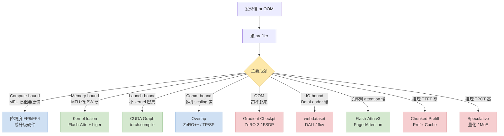

> 系列前面 10 篇每篇聚焦一个具体技术。这篇**从全局视角**把它们放在同一张地图上——按**阶段 / 瓶颈 / 触达层**三维分类，给决策流，最后附 60+ 条**大模型训推加速术语表**。新人入场看完这篇再决定深挖哪个子方向。

---

## 零、本文骨架

| 小节 | 主题 | 产出 |
|---|---|---|
| §一 | 引子：技术栈太多，从哪看起 | 全局导图定位 |
| §二 | 三维度分类 | 阶段 / 瓶颈 / 触达层 |
| §三 | 全景图（核心） | 大 mermaid：8 大类加速技术关系 |
| §四 | 瓶颈 → 技术决策流 | 对照 §二 的诊断 → 选型 |
| §五 | 系列各篇映射 | 本系列每篇在地图哪一块 |
| §六 | 2026 趋势 | FP4 / MoE / Agent 栈 / 长上下文 |
| §七 | 场景选型建议 | pretrain / SFT / serve 三档 |
| §八 | **大模型训推加速术语表** | 60+ 条速查 |
| §九 | 权威参考 | - |

---

## 一、引子：技术栈太多，从哪看起

训推加速的"技术噪音"极大——2024~2026 两年里仅主流的加速技术就冒出来几十个：FlashAttention v1/v2/v3、Paged Attention、Continuous Batching、Speculative Decoding、Medusa、EAGLE、MoE 各派、FP8/FP4 推理、KV Quant、Chunked Prefill、FSDP v2、Megatron-LM TP/SP、ZeRO++、cuGraph、torch.compile…

**读者痛点**：
- 每个技术都有 blog 写得很好，但**技术之间的关系**没人说清
- 遇到具体瓶颈不知道**该选哪个**
- "先做什么后做什么"的优先级不明

本文不深入单项技术（系列其他篇干这事），专注**全局关系 + 决策导航**。

---

## 二、三维度分类

### 2.1 按加速阶段

```
Pre-training       → 最大化 MFU 和 TGS，数据吞吐决定进度
SFT / Fine-tuning  → 低显存 + 快迭代（PEFT / QLoRA）
RLHF / DPO         → 多模型同时加载，显存压力大
Serving / Inference → 延迟 + 吞吐 + 成本三角
```

### 2.2 按性能瓶颈

| 瓶颈 | 检测 | 主要技术 |
|---|---|---|
| **Compute-bound** | MFU 高，但算力不够快 | 更好硬件 / 低精度（FP8/FP4） / 更好 kernel |
| **Memory-bound** | MFU 低，BW util 高 | Kernel fusion / AI 提升 / KV quant |
| **Communication-bound** | 多机 scaling 效率低 | Overlap / 拓扑优化 / ZeRO++ |
| **Launch-bound** | 大量小 kernel | CUDA Graph / torch.compile / fused kernel |
| **IO-bound** | DataLoader / checkpoint 慢 | 见 [CPU SOP §六/七](/posts/2026-05-07-python-cpu-bottleneck-troubleshooting-sop.html) |

### 2.3 按触达层

自顶向下：

```
应用层     ├─ Serving system (vLLM / SGLang / TRT-LLM)
           ├─ Scheduling (continuous batching / chunked prefill)
系统层
           ├─ Compiler (torch.compile / Inductor / TensorRT)
           ├─ Framework (PyTorch / Megatron / DeepSpeed / FSDP)
Kernel 层  ├─ Library (Flash-Attn / Liger / Apex / xFormers)
           └─ Custom Triton / CUDA
模型层     ├─ Architecture (GQA / MoE / SwiGLU / RoPE)
           └─ Precision (BF16 / FP8 / FP4 / INT4)
硬件层     └─ GPU / NPU / Network (NVLink / IB / RoCE)
```

**原则**：**"就近层"优化优先**——模型层收益最大改动最小，kernel 层改动中等收益中等，硬件层需要换设备成本高。

---

## 三、训推加速全景图（核心）

```mermaid
graph TD
    Root[训推加速技术栈]

    Root --> Dist[分布式并行]
    Root --> Prec[低精度]
    Root --> Fuse[Kernel Fusion]
    Root --> Graph[Graph Optim]
    Root --> Mem[显存优化]
    Root --> Infer[推理专属]
    Root --> Arch[架构优化]
    Root --> Sys[系统调度]

    Dist --> D1[DP / TP / PP / SP / EP / FSDP]
    Dist --> D2[ZeRO 1/2/3 ZeRO++]
    Dist --> D3[通信 overlap]

    Prec --> P1[BF16 / FP16 混精]
    Prec --> P2[FP8 Training]
    Prec --> P3[INT8 / FP8 Inference]
    Prec --> P4[INT4 / FP4 Weight-only]

    Fuse --> F1[Flash-Attention 2/3]
    Fuse --> F2[Liger / Apex]
    Fuse --> F3[Custom Triton]

    Graph --> G1[torch.compile]
    Graph --> G2[CUDA Graph]
    Graph --> G3[TensorRT engine]

    Mem --> M1[Gradient Checkpointing]
    Mem --> M2[Activation Offload]
    Mem --> M3[KV Cache Quant]
    Mem --> M4[Paged Attention]

    Infer --> I1[Speculative Decoding]
    Infer --> I2[Continuous Batching]
    Infer --> I3[Chunked Prefill]
    Infer --> I4[Prefix Cache]

    Arch --> A1[GQA / MQA]
    Arch --> A2[MoE]
    Arch --> A3[SwiGLU / Rotary]
    Arch --> A4[Linear / State Space]

    Sys --> S1[Scheduler]
    Sys --> S2[Load Balancing]
    Sys --> S3[Autoscaling]

    style Root fill:#FDE8A9,stroke:#E7C56D
    style Dist fill:#CFE0F3,stroke:#8AB0DB
    style Prec fill:#CFE0F3,stroke:#8AB0DB
    style Fuse fill:#D4E8CF,stroke:#94C18A
    style Graph fill:#D4E8CF,stroke:#94C18A
    style Mem fill:#F6CED0,stroke:#D98F92
    style Infer fill:#F6CED0,stroke:#D98F92
    style Arch fill:#FDE8A9,stroke:#E7C56D
    style Sys fill:#FDE8A9,stroke:#E7C56D
```



**颜色语义**：蓝 = 分布式 / 精度，绿 = 编译 / 融合，粉 = 显存 / 推理，黄 = 架构 / 系统。

### 3.1 Fusion 阵营的扛旗者：Flash-Attention


*图：Flash-Attention 用 tile + online softmax 把 attention 从 memory-bound 拉到 compute-bound，是 2022 年以来单项影响最大的 kernel。来源：Dao-AILab/flash-attention*

### 3.2 分布式训练的地基：DeepSpeed / ZeRO


*图：ZeRO 论文 Figure 1——Baseline（每卡完整 P+G+Opt）→ P_os（按卡分 Optimizer States）→ P_os+g（再分 Gradients）→ P_os+g+p（最终所有都分）。7.5B 模型从 120GB / 卡 降到 1.9GB / 卡。PyTorch FSDP 直接继承这个范式。来源：Rajbhandari et al. 2020, arXiv:1910.02054*

---

## 四、瓶颈 → 技术决策流



**使用流程**：profile → 判断主瓶颈 → 找对应叶子节点 → 按该技术找教程 / 本系列对应篇。

---

## 五、系列各篇映射

本训推加速系列 10+ 篇在地图上的位置：

| 本系列 post | 对应技术地图区域 |
|---|---|
| [CLI 工具栈](/posts/2026-05-07-training-inference-engineer-cli-toolkit.html) | 工具层，无具体技术 |
| [GPU/NCCL SOP](/posts/2026-05-07-training-inference-acceleration-troubleshooting-sop.html) | 瓶颈诊断总纲 |
| [CPU 侧 SOP](/posts/2026-05-07-python-cpu-bottleneck-troubleshooting-sop.html) | IO-bound / CPU 瓶颈 |
| [Qwen3 fusion 识别](/posts/2026-05-07-qwen3-understand-model-identify-fusion.html) | Fusion 理论 + 访存比 |
| [Triton kernel 实战](/posts/2026-05-07-triton-kernel-fusion-practice.html) | Kernel Fusion / Custom Triton |
| [精度对齐](/posts/2026-05-08-fused-kernel-accuracy-alignment.html) | 精度验证 SOP |
| [Gradient Checkpointing](/posts/2026-05-08-gradient-checkpointing-qwen3-dense.html) | 显存优化 / Selective GC |
| [CUDA Graph 实战](/posts/2026-05-08-cuda-graph-qwen3-dense.html) | Graph Optim / Launch-bound |
| [效率指标](/posts/2026-05-08-training-inference-efficiency-metrics.html) | 测度 / 诊断基础 |
| [效果指标](/posts/2026-05-08-training-inference-quality-metrics.html) | 效果验证 / 评测 |
| **本文** | 全局地图 + 术语表 |

**还没写的 / 待补**：MoE 专篇、Speculative Decoding 专篇、FP8/FP4 专篇、PagedAttention 与 vLLM 深度剖析。

---

## 六、2026 趋势（可能的下一波）

1. **FP4 训练**：H100/B200 上实测可行，Qwen4 / GPT-5 规模可能常态化
2. **MoE scaling**：稀疏激活 + Expert Parallelism 标配，Qwen3-MoE / DeepSeek-V3 / GPT-OSS 都走这条
3. **长上下文**：128K 起步、1M 成常见规格，driver 是 KV quantization + chunked prefill + ring attention
4. **Speculative 家族**：EAGLE / Medusa / Lookahead 融合，decode 速度 2~4x
5. **Graph Compilation 再升级**：torch.compile 3.0 / TensorRT-LLM 的 engine 固化
6. **推理栈收敛**：vLLM / SGLang / TensorRT-LLM 三足鼎立；后续是 agent 服务栈（Claude Code / Codex / Cursor 式）
7. **硬件多样化**：B200 / GB200 NVL / 国产 AI 芯片涌现，kernel 要 portable
8. **Inference-time Scaling**：推理时做多次搜索（o1 / Qwen-Reasoning）——算力预算从训练挪向推理

---

## 七、场景选型建议

### Pre-training (8B~70B dense)

```
必做:
  ✓ BF16 混精（或 FP8 如果硬件支持）
  ✓ Flash-Attention 2/3
  ✓ FSDP or Megatron-LM TP/SP 并行
  ✓ Gradient Checkpointing (selective)
  ✓ 好 DataLoader (webdataset / packed)

推荐:
  ✓ Liger Kernel
  ✓ torch.compile + CUDA Graph

锦上添花:
  ± 自写 Triton kernel (ROI 不高, 除非 novel ops)
  ± FP8 Training (如 H100/B200 且训练稳定)
```

### SFT / Instruction Tuning (全参或 LoRA)

```
必做:
  ✓ QLoRA (NF4 weight + LoRA adapter)
  ✓ Unsloth / Liger
  ✓ Flash-Attention

推荐:
  ✓ Gradient Accumulation 扩 batch
  ✓ Packing (多样本拼接)

可选:
  ± Selective GC
  ± torch.compile
```

### Serving / Inference

```
必做:
  ✓ vLLM / SGLang / TRT-LLM 之一
  ✓ Paged Attention (vLLM 默认)
  ✓ Continuous Batching
  ✓ CUDA Graph for decode

推荐:
  ✓ Prefix Caching (共享前缀场景)
  ✓ Speculative Decoding (长输出场景)
  ✓ KV quant (INT8/FP8 KV)

按需:
  ± Weight quant (INT4 / FP4) for memory-limited serving
  ± Chunked Prefill (长 prompt 请求多场景)
```

---

## 八、大模型训推加速术语表（60+ 条速查）

按字母序排。有链接的是本系列已深入讲过的。

### A–E

- **AI (Arithmetic Intensity / 访存比)** = FLOPs/Bytes。[见 Qwen3 fusion §3.4](/posts/2026-05-07-qwen3-understand-model-identify-fusion.html)
- **Activation Checkpointing** = Gradient Checkpointing，同义。[见 GC 篇](/posts/2026-05-08-gradient-checkpointing-qwen3-dense.html)
- **All-Reduce** = 分布式通信原语，汇总 N 个 rank 的 tensor 再广播。
- **AMP (Automatic Mixed Precision)** = PyTorch 自动混精，配合 `GradScaler` 保持数值稳定。
- **Attention Head** = 多头注意力的一个头；Qwen3-8B 有 32 个 query head、8 个 KV head（GQA）。
- **BF16 (bfloat16)** = 1 sign + 8 exp + 7 mantissa，范围大精度低，训练友好。
- **Batch Size** = 单次前向/反向处理的样本数。
- **CUDA Graph** = 预录 kernel 序列 + 回放，消除 launch 开销。[专篇](/posts/2026-05-08-cuda-graph-qwen3-dense.html)
- **Continuous Batching** = vLLM 把不同请求动态拼进同一 batch，提升 serving 吞吐。
- **CE (Cross-Entropy)** = 分类 loss 标准形式。[公式](/posts/2026-05-08-training-inference-quality-metrics.html)
- **Chunked Prefill** = 把长 prefill 切片和 decode 拼一起处理，降 TTFT 尾部。
- **DP (Data Parallel)** = 每卡完整模型，不同数据。
- **DeepSpeed** = 微软训练框架；ZeRO 系列 + Offload。
- **DPO (Direct Preference Optimization)** = 不要 reward model 的 RLHF 替代。

### F–L

- **Flash-Attention** = Tri Dao 的 attention 算子，tile + online softmax。v1/v2/v3 逐代优化。
- **FSDP (Fully Sharded Data Parallel)** = PyTorch 版 ZeRO-3，参数 / 梯度 / 优化器全部 shard。
- **FP8** = 1+4+3 或 1+5+2 两种格式，H100/B200 支持。训练和推理都能用。
- **FP4** = 新一代低精度，B200 原生支持，Weight-only 已落地。
- **GQA (Grouped-Query Attention)** = 多个 Q head 共享一个 KV head，省 KV 显存。Qwen3 标配。
- **Gradient Checkpointing** = 丢中间 activation、backward 重算。[专篇](/posts/2026-05-08-gradient-checkpointing-qwen3-dense.html)
- **Goodput** = 满足 SLO 的吞吐（vLLM 提出）。[公式](/posts/2026-05-08-training-inference-efficiency-metrics.html)
- **HBM (High Bandwidth Memory)** = GPU 主显存，H100 80GB HBM3 ≈ 3TB/s。
- **HFU (Hardware FLOPs Utilization)** = 含重算的 FLOPs 利用率。
- **ITL (Inter-Token Latency)** = 流式 decode 相邻 token 间隔。
- **KL Divergence** = 两概率分布的差异度量。[公式](/posts/2026-05-08-training-inference-quality-metrics.html)
- **KV Cache** = decode 时缓存历史 token 的 K/V，避免重算。
- **Liger Kernel** = LinkedIn 为 Qwen/Llama 家族做的 fused kernel 集合。
- **LoRA** = Low-Rank Adaptation，PEFT 主流之一。

### M–R

- **Megatron-LM** = NVIDIA 训练框架；TP / SP / PP 并行。
- **MFU (Model FLOPs Utilization)** = 模型 FLOPs 与硬件峰值 FLOPs 比值。
- **MoE (Mixture of Experts)** = 稀疏激活 —— N 个 expert 每 token 只路由到 top-k 个。
- **MQA (Multi-Query Attention)** = Q 有 multi head，KV 只 1 head。
- **MMLU** = 57 学科选择题 benchmark。
- **NCCL** = NVIDIA 分布式通信库。
- **Paged Attention** = vLLM 把 KV cache 按 page 管理（像 OS paging），减少碎片。
- **PEFT (Parameter-Efficient Fine-Tuning)** = LoRA / QLoRA / Prefix Tuning 等总称。
- **Perplexity (PPL)** = `exp(CE)`，模型困惑度。[公式](/posts/2026-05-08-training-inference-quality-metrics.html)
- **PP (Pipeline Parallel)** = 模型分阶段放到不同卡。
- **Prefix Caching** = 共享 prompt 前缀的 KV 重用。
- **QLoRA** = 4-bit 量化 + LoRA 微调。
- **RoPE (Rotary Position Embedding)** = Llama/Qwen 系列的位置编码方式。
- **RLHF** = Reinforcement Learning from Human Feedback。
- **Roofline** = 算力/带宽 vs 访存比的性能上限图。[专篇](/posts/2026-05-07-qwen3-understand-model-identify-fusion.html)

### S–Z

- **SM (Streaming Multiprocessor)** = GPU 计算单元，H100 有 132 个 SM。
- **SP (Sequence Parallel)** = Megatron 的序列维度并行，和 TP 搭配。
- **Speculative Decoding** = 小模型草稿 + 大模型验证，decode 加速 2~4x。
- **SLO (Service Level Objective)** = 服务等级目标，TTFT/P99 的上限承诺。
- **SwiGLU** = `silu(W_gate x) * W_up x`，Llama / Qwen MLP 激活。
- **TGS (Tokens per GPU per Second)** = 分布式训练扩展性指标。[公式](/posts/2026-05-08-training-inference-efficiency-metrics.html)
- **TP (Tensor Parallel)** = 矩阵按列或行 shard 到多卡。
- **TPOT (Time Per Output Token)** = decode 平均每 token 时间。
- **TTFT (Time To First Token)** = prefill 阶段延迟。
- **Triton** = OpenAI 的 GPU DSL，Python 写 kernel。[实战](/posts/2026-05-07-triton-kernel-fusion-practice.html)
- **torch.compile** = PyTorch 2.x 的图编译器（Inductor 后端）。
- **vLLM** = UC Berkeley 的开源推理引擎，Paged Attention 原创。
- **WER / CER (Word/Character Error Rate)** = 语音识别评测。[公式](/posts/2026-05-08-training-inference-quality-metrics.html)
- **ZeRO (Zero Redundancy Optimizer)** = DeepSpeed 提出；ZeRO-1/2/3 分别 shard 优化器 / 梯度 / 参数。
- **ZeRO++** = ZeRO 升级版，量化通信。

---

## 九、权威参考

- [PyTorch 2.x — Accelerating AI](https://pytorch.org/blog/accelerating-generative-ai-2/)
- [Flash-Attention (Dao)](https://github.com/Dao-AILab/flash-attention)
- [vLLM](https://docs.vllm.ai/)
- [SGLang](https://github.com/sgl-project/sglang)
- [TensorRT-LLM](https://github.com/NVIDIA/TensorRT-LLM)
- [Megatron-LM](https://github.com/NVIDIA/Megatron-LM)
- [DeepSpeed](https://www.deepspeed.ai/)
- [FSDP 文档](https://pytorch.org/docs/stable/fsdp.html)
- [Liger Kernel](https://github.com/linkedin/Liger-Kernel)
- [Triton](https://triton-lang.org/)
- [NVIDIA — Scaling Language Model Training](https://developer.nvidia.com/blog/scaling-language-model-training-to-a-trillion-parameters-using-megatron/)
- [Chinchilla (scaling laws)](https://arxiv.org/abs/2203.15556)
- [PaLM (MFU 定义)](https://arxiv.org/abs/2204.02311)
- [MT-Bench / Chatbot Arena](https://arxiv.org/abs/2306.05685)
- [Speculative Decoding (Google)](https://arxiv.org/abs/2211.17192)
- 本系列：
  - [CLI 工具栈](/posts/2026-05-07-training-inference-engineer-cli-toolkit.html)
  - [GPU/NCCL SOP](/posts/2026-05-07-training-inference-acceleration-troubleshooting-sop.html)
  - [CPU 侧 SOP](/posts/2026-05-07-python-cpu-bottleneck-troubleshooting-sop.html)
  - [Qwen3 fusion 识别](/posts/2026-05-07-qwen3-understand-model-identify-fusion.html)
  - [Triton 实战](/posts/2026-05-07-triton-kernel-fusion-practice.html)
  - [精度对齐](/posts/2026-05-08-fused-kernel-accuracy-alignment.html)
  - [Gradient Checkpointing](/posts/2026-05-08-gradient-checkpointing-qwen3-dense.html)
  - [CUDA Graph](/posts/2026-05-08-cuda-graph-qwen3-dense.html)
  - [效率指标](/posts/2026-05-08-training-inference-efficiency-metrics.html)
  - [效果指标](/posts/2026-05-08-training-inference-quality-metrics.html)

---

> **一句话总结**：训推加速不是单个魔法——三维分类让你知道"加速有哪几类"、全景图告诉你"它们怎么关联"、决策流让你"从瓶颈找技术"、术语表让你"读别人论文不卡壳"。先把地图建立起来，再深挖具体子方向。
