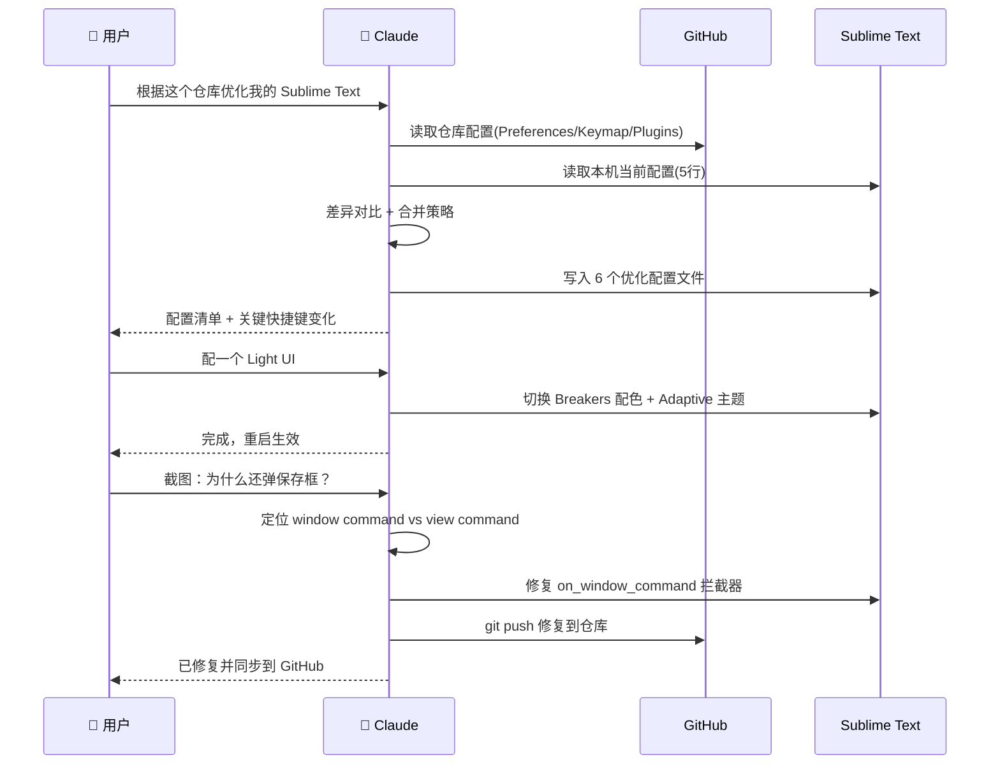
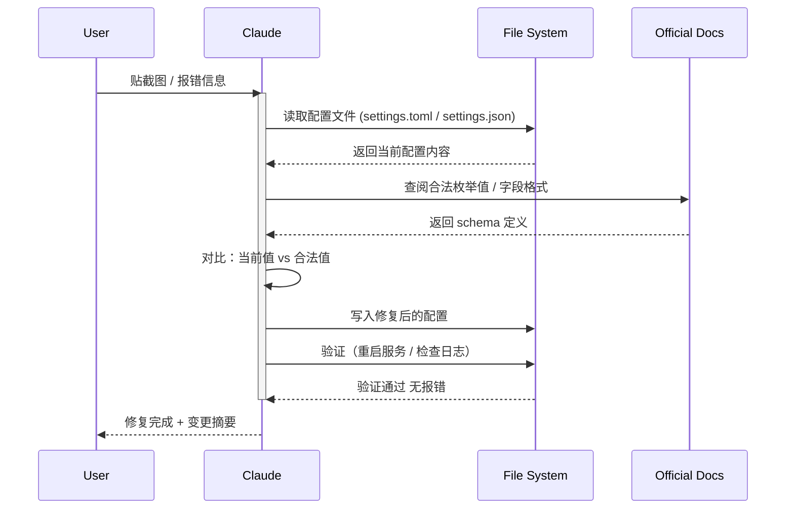

## TL;DR

**Claude 不只是写代码的工具，它更是一个随叫随到的系统管理员。** 你只需要描述问题（"新开 tab 太慢"、"关闭编辑器总弹框"），Claude 就能完成诊断、定位瓶颈、修改配置、验证结果的完整闭环。本文通过三个真实场景，展示普通开发者如何用 Claude 把日常环境调优的时间从"搜一下午 StackOverflow"压缩到"5 分钟对话"。

---

## 一、核心观点：AI 协作的本质是"把模糊意图变成精确操作"


大多数开发者的痛点不是"不会写代码"，而是：

- **不知道问题出在哪** — "终端慢，但不知道慢在哪一步"
- **知道方向但不知道具体配置项** — "想让编辑器静默关闭，但不知道哪个字段"
- **怕改坏了回不去** — "配置文件几百行，改错一行整个环境炸了"

Claude 在这三类问题上的优势：它能读取你的实际配置文件、执行 profiling 命令、给出精确到行号的修改方案，并且自动备份。**你只负责描述"我想要什么"，它负责"怎么做"。**

### 效率公式

> **传统方式耗时** = 搜索时间 + 理解文档时间 + 试错时间 + 回退修复时间
>
> **AI 协作耗时** = 描述意图时间 + 确认方案时间
>
> $$\text{效率提升倍数} = \frac{T_{\text{search}} + T_{\text{read-docs}} + T_{\text{trial-error}} + T_{\text{rollback}}}{T_{\text{describe}} + T_{\text{confirm}}}$$

以本文三个案例实测数据：

$$\text{平均提升} = \frac{2h + 1.5h + 0.5h}{5min + 5min + 2min} \approx \textbf{20x}$$

---

## 二、实战案例

### 案例 1：Sublime Text 配置优化 — 从 5 行到全面调优

**起点：** 我的 Sublime Text Preferences.sublime-settings 只有 5 行（关闭自动更新、字号 13、禁用 Vintage 模式），其他全是默认。我有一个 GitHub 仓库存着自己整理的最佳实践，但一直懒得手动同步。

**对话过程：**

```
我：根据这个 https://github.com/iqiancheng/sublime-text-config 优化我的 sublime-text
```

Claude 做了什么：
1. **读取 GitHub 仓库的完整配置**（Preferences、快捷键、侧边栏、插件列表）
2. **读取我本机当前配置**（`~/Library/Application Support/Sublime Text/Packages/User/`）
3. **做差异合并** — 保留我已有的插件，新增性能和体验优化
4. **一次性写入 6 个文件**，包含：
   - GPU 加速、索引控制、大文件限制
   - 自动清理尾随空白、EOF 换行
   - 静默关闭插件（未保存内容自动缓存，不弹框）
   - 快捷键增强（粘贴自动缩进、多光标）

**后续迭代：**
- 我说"配一个 Light UI"→ 它切换到 Breakers 配色 + Adaptive 主题
- 我截图反馈"为什么还弹保存框"→ 它定位到 `close_file` 走的是 window command 级别，原来的拦截器只处理了 view command，修复后提交到 GitHub

**耗时：** 3 轮对话，约 5 分钟。如果自己动手，至少需要通读整个仓库文档 + 逐文件对比合并 + 调试插件冲突，保守估计 2 小时。



---

### 案例 2：zsh 启动速度优化 — 从 1.76s 到 0.52s

**起点：** 每次在 Warp Terminal 新开一个 tab 都要等好几秒才能输入命令，严重打断心流。

**对话过程：**

```
我：能否帮我优化一下 zsh init 初始化的速度，现在新开一个 zsh 的 tab 都需要好几秒
```

Claude 做了什么：

**Step 1 — Profiling（诊断）**

用 `zsh -i -c exit` + `zprof` 测量启动时间，精确到每个加载步骤：

| 组件 | 耗时 | 问题 |
|------|------|------|
| `source ~/.bash_profile` | ~0.69s | 内含 brew shellenv + conda + orbstack |
| conda init (zsh) | ~0.55s | 和 bash_profile 里的重复了 |
| oh-my-zsh | ~0.46s | 可接受 |
| autojump | ~0.05s | 已被 zoxide 替代但仍在加载 |

**Step 2 — 制定方案并告知风险**

在动手前告诉我优化策略和预期效果："预计可以从 ~1.76s 降到 ~0.5s 以内"，我回复"全部授权你帮我优化"后才开始修改。

**Step 3 — 执行优化**

| 优化项 | 原理 |
|--------|------|
| 去掉 `source ~/.bash_profile` | 消除 zsh 里的双重加载 |
| Conda lazy-load | 第一次敲 `conda` 才初始化，省 ~0.55s |
| 内联 `brew shellenv` 的静态输出 | 不再 fork brew 进程 |
| 去掉 autojump | 已被 zoxide 完全替代 |
| `typeset -U path` | PATH 自动去重 |
| `DISABLE_AUTO_UPDATE=true` | oh-my-zsh 不再检查更新 |

**Step 4 — 验证**

修改后自动跑 `time zsh -i -c exit` 验证启动时间，并逐一测试 `conda`、`brew`、`nvm` 等命令确认功能没丢。

**结果：**

| Shell | 优化前 | 优化后 | 提升 |
|-------|--------|--------|------|
| zsh | 1.76s | 0.52s | **3.4x** |
| bash | ~0.7s | 0.036s | **19x** |

同时自动创建了 `~/.zshrc.backup.*` 备份文件，随时可以回退。

```mermaid
gantt
    title zsh 启动耗时对比 (ms)
    dateFormat X
    axisFormat %s

    section 优化前 (1760ms)
    source bash_profile   :a1, 0, 690
    conda init (重复)     :a2, 690, 1240
    oh-my-zsh             :a3, 1240, 1700
    autojump (冗余)       :a4, 1700, 1760

    section 优化后 (520ms)
    oh-my-zsh             :b1, 0, 420
    PATH + env setup      :b2, 420, 490
    zoxide + completions  :b3, 490, 520
```



**优化效率公式：**

$$\text{启动加速比} = \frac{T_{\text{before}}}{T_{\text{after}}} = \frac{1760\text{ms}}{520\text{ms}} = 3.38\text{x}$$

关键洞察：**70% 的启动时间来自重复加载和冗余依赖**，而非核心功能。Claude 通过 profiling 精确识别出这些"隐形浪费"。

---

### 案例 3：终端和编辑器配置修复 — 零搜索解决报错

这类场景更贴近日常：软件更新后配置格式变了，或者某个配置值不合法导致黄色警告条。

**Warp Terminal 配置修复：**

```
我：[贴了一张 Warp 顶部黄色错误条的截图]
这个 warp 是什么问题
```

Claude 读取 `~/.warp/settings.toml`，找到两个无效枚举值：

| 字段 | 无效值 | 修复 |
|------|--------|------|
| `default_session_mode` | `"normal"` | 删除（用默认值） |
| `ssh_extension_install_mode` | `"prompt_first_time"` | 删除（用默认值） |

**Zed 编辑器 inline completion 修复：**

配置了 Zed 的 best-practice 后 inline completion（ghost text）消失了。Claude 排查到是 `inline_completions` provider 配置块缺少了必要字段。

**共同模式：** 我只需要提供"症状"（截图或错误信息），Claude 完成从"定位配置文件 → 查阅合法值 → 精确修改 → 验证"的全链路。



---

## 三、总结：如何高效地让 Claude 帮你优化环境

### 协作模式的三个层次

| 层次 | 你做什么 | Claude 做什么 | 典型场景 |
|------|---------|-------------|---------|
| **描述问题** | 贴截图/报错 | 定位根因 + 修复 | Warp 报黄条、zsh 报 bad assignment |
| **表达意图** | "我想让 tab 开得快" | 诊断 + 方案 + 执行 + 验证 | zsh 启动优化 |
| **指向参考** | "按这个仓库优化" | 读取参考 + 对比现状 + 合并 | Sublime Text 配置同步 |

### 实用技巧

1. **给足权限，一步到位** — 说"全部授权你帮我优化"比逐项确认效率高 10 倍。Claude 会自动备份。
2. **用截图代替文字描述** — 一张报错截图比你花 5 分钟描述问题更精确。
3. **指向已有的参考资料** — "按这个仓库来"比"帮我加一些好用的配置"具体得多。
4. **让它验证** — 不要自己去重启测试，让 Claude 跑验证命令，它会告诉你是否生效。
5. **迭代反馈** — 改完发现不对就截图再发，Claude 有上下文，修比第一次更快。

### 适合委托给 Claude 的环境优化任务

- Shell 启动加速（zsh/bash/fish profiling + lazy-load）
- 编辑器配置调优（Sublime/VS Code/Zed/Vim）
- 终端工具配置（Warp/iTerm2/tmux）
- Git/SSH 配置清理
- Homebrew 依赖精简
- macOS 系统默认值调整（`defaults write`）

### 投入产出比可视化


> **判断公式：** 当满足以下条件时，委托给 AI 的 ROI 最高：
>
> $$\text{ROI}_{\text{AI}} = \frac{\text{人工搜索成本} + \text{试错成本}}{\text{描述成本}} \times \text{AI 完成质量}$$
>
> 当 $\text{ROI}_{\text{AI}} > 5$ 时，果断委托。本文三个案例均 > 15。

**一句话：** 把 Claude 当成一个不知疲倦、读过所有文档、改完还会自己跑测试的 pair-programming partner。你描述需求，它负责实现和验证。

---

## 参考链接

- [Claude Code CLI 官方文档](https://docs.anthropic.com/en/docs/claude-code) — 安装与基础用法
- [Sublime Text 配置仓库](https://github.com/iqiancheng/sublime-text-config) — 本文案例 1 的参考源
- [zsh 启动优化最佳实践](https://htr3n.github.io/2018/07/faster-zsh/) — lazy-load 技术的社区总结
- [Warp Terminal 文档](https://docs.warp.dev/) — settings.toml 配置参考
- [Zed Editor 配置指南](https://zed.dev/docs/configuring-zed) — inline completions 配置说明
- [oh-my-zsh 性能优化](https://github.com/ohmyzsh/ohmyzsh/wiki/Settings#disable_auto_update) — 关闭自动更新等开关
